# 0. Introduction

Here, we will demonstrate how a microbiome analysis may look in
practice. For this demonstration, we have adapted some shotgun
metagenomic data from the `curatedMetagenomicData` library in R. We’re
looking at a human cohort starring in the *Metagenome-wide association
of gut microbiome features for schizophrenia* study (DOI:
10.1038/s41467-020-15457-9). After downloading the data it was
simplified by summing together all strains by genus. This will make it
easier to analyse without access to a server. For the set of operations
used to pre-process, please see section [Download and pre-process
microbiome
data](https://github.com/thomazbastiaanssen/Tjazi/blob/master/guidebook_sup/part2/README_part2.md)
in the supplementary materials of part II of this perspective piece.
Briefly, in this data set, we have WGS data from faecal samples from
both patients with schizophrenia and healthy volunteers, which will be
referred to as “healthy” in the Legends. This data has been included in
the `Tjazi` library on github for easy access purposes. Notably, we’ll
be using smoking status and sex to demonstrate including a covariate in
the analysis. All R code used to transform, wrangle (reorganise) and
plot the data is also shown below as to hopefully provide a toolkit for
aspiring and veteran bioinformaticians alike. It should be noted that
the analysis performed here may not perfectly correspond to the one
performed in the original 2020 manuscript, nor does the outcome (though
they do generally agree in that there is an effect of schizophrenia in
the microbiome). This is expected and indeed very common for microbiome
studies. It is the result of using a different statistical paradigm and
should in no way discredit the original analysis.

### Code chunk: Load our libraries

``` r
#Statistical tools        Primarily PERMANOVA, alpha diversity and the CLR transformation.
library(vegan)            #install.packages("vegan")
library(iNEXT)            #install.packages("iNEXT")
library(Tjazi)            #devtools::install_github("thomazbastiaanssen/Tjazi")

#Data Wrangling
library(tidyverse)        #install.packages("tidyverse")
library(knitr)            #install.packages("knitr")
library(waldo)            #install.packages("waldo")

#Plotting
library(ggplot2)          #install.packages("ggplot2")
library(ggforce)          #install.packages("ggforce")
library(patchwork)        #install.packages("patchwork")
library(ggbeeswarm)       #install.packages("ggbeeswarm")
library(metafolio)        #install.packages("metafolio")

#Load prepared data from the schizophrenia study stored in the Tjazi library
data(guidebook_data)
```

### Code chunk: Load our count table and perform the CLR-transformation

``` r
#Disable strings automatically being read in as factors to avoid unintuitive behaviour.
options(stringsAsFactors = F)

#Set a seed for the purposes of reproducibility in this document.
set.seed(1)

#Load in the genus level count table and the metadata file. 
#Since we're using prepared data, we already loaded it using `data(guidebook_data)`, 
#but typically we'd do something like this:
#
#counts <- read.delim("genus_level_counts.csv", sep = ",", row.names = 1, header = T)
counts   <- counts ; metadata <- metadata

#To be safe, let's check whether our metadata and our count table have the same names.
print(waldo::compare(sort(metadata$master_ID), sort(colnames(counts)), max_diffs = 5))
```

    ##     old               | new                               
    ## [1] "wHAXPI032581-18" - "wHAXPI032581.18" [1]             
    ## [2] "wHAXPI032582-19" - "wHAXPI032582.19" [2]             
    ## [3] "wHAXPI032583-21" - "wHAXPI032583.21" [3]             
    ## [4] "wHAXPI032584-22" - "wHAXPI032584.22" [4]             
    ## [5] "wHAXPI032585-23" - "wHAXPI032585.23" [5]             
    ## ... ...                 ...               and 166 more ...

``` r
#Looks like the metadata names contain dashes whereas the count table contains points. 
#We'll change the dashes into dots in the metadata file. 
metadata$master_ID <- gsub(metadata$master_ID, pattern = "-", replacement = ".")

#Reorder the columns based on the metadata.
counts  <- counts[,metadata$master_ID]

#Fork off your count data so that you always have an untouched version handy.
genus   <- counts

#make sure our count data is all numbers
genus   <- apply(genus,c(1,2),function(x) as.numeric(as.character(x)))

#Remove features with prevalence < 10% in two steps:
#First, determine how often every feature is absent in a sample
n_zeroes <- rowSums(genus == 0)

#Then, remove features that are absent in more than your threshold (90% in this case).
genus    <- genus[n_zeroes <= round(ncol(genus) * 0.90),]
 
#Perform a CLR transformation - #We are imputing zeroes using the 'const' method 
#Essentially, we replace zeroes with 65% of the next lowest value - see Lubbe et al 2021. 
genus.exp <- clr_c(genus)
```

------------------------------------------------------------------------

# Intermezzo: Interpreting Centered Log-Ratio Transformed Data

The centered log-ratio (CLR) transformation may be the most common
approach to deal with compositional data, such as microbiome sequencing
data. We will not go into the reasons why this transformation is used
here - see the main text - but we will provide some material to help
form intuition on what the CLR transformation does and how to interpret
it. Let’s start by taking a look at the mathematical notation.

Let’s say we have microbiome sample which we will treat as a vector
called $\bf{x}$ with size $D$. We’ll refer to the taxa - or more
generally the elements - of this vector $\bf{x}$ as ${x}_1$ - ${x}_D$.
Then, CLR-transforming that vector $\bf{x}$ would look like this:

$$
clr({\bf{x}}) = \left \lbrace \ln \left (\frac{{x}_{1}}{G({\bf x})} \right), \dots, \ln \left (\frac{{x}_{D}}{G({\bf x})} \right) \right \rbrace 
$$

Where ${G({\bf x})}$ is the geometric mean of $\bf{x}$. Let’s go through
it step by step.

You can calculate the geometric mean of a set of *n* numbers by
multiplying them together and then taking the *n*<sup>th</sup> root.
Just like the ‘regular’ mean, the geometric mean says something about
the center of your data.

Essentially what this says is that in order to get the CLR-transformed
values of a vector, you take every element of that vector, divide it by
the geometric mean of the entire vector and then take the natural
logarithm of the result and you’re done.

We can deduce a few things about this transformation.

- First, since we’re taking a natural logarithm,
  $\frac{x_{n}}{G({\bf x})}$ can never be zero as the logarithm of zero
  is undefined. This means that we need to either replace or remove
  every zero in our data before we use this transformation. We expand on
  strategies for this in the main text.
- Second, the possible range of our data has changed. Regular counts can
  go from 0 to infinity and relative abundance data can go from 0 to 1,
  but CLR-transformed data can go from negative infinity to positive
  infinity. The logarithm of a very small number divided by a very large
  number will be very negative.
- Third, if $x_{n}$ is exactly the same as the geometric mean
  $G({\bf x})$, $\frac{x_{n}}{G({\bf x})}$ will be 1 and thus
  $clr(x_{n})$ will be 0 as the logarithm of 1 is equal to 0. This gives
  us some intuition about the size of CLR-transformed values. Going
  further on this, it means that an increase of 1 on a CLR-transformed
  scale corresponds to multiplying with *e*, Euler’s number, which is
  approximately equal to 2.718282. Conversely, a decrease of 1 on a
  CLR-transformed scale corresponds to dividing by *e*.

Furthermore there are a few points to keep in mind when interpreting
CLR-transformed values.

- First, the CLR-transformation is especially useful in the scenario
  where most features do not change, so that the geometric mean remains
  reasonably stable between your samples. If the geometric mean is very
  different between your samples, you’re dividing by very different
  values between your samples.
- Second, especially for microbiome sequencing experiments, we are
  usually dealing with how many reads we found for any given organism.
  Typically, we cannot relate this back to the absolute or even the
  relative abundances of those organisms, as all microbes have their own
  *microbe-to-reads* conversion rate (again see the main text). Even so,
  the ratios between the reads are still highly informative.

The CLR-transformation is not a *perfect solution* for
compositionality - in fact the idea of a solution to a type of data
seems a little odd - but in practice the CLR-transformation tends to be
a handy tool on the belt of a bioinformatician. Understanding what
exactly it does will greatly improve its utility and reduce the chance
of misinterpreting an analyisis.

------------------------------------------------------------------------

# 1. Stacked Barplots

Stacked barplots provide a visually appealing overview of the
composition of each sample. Normally, no tests are performed here, but
they can be helpful to give the data a visual check over and to show
obvious shifts in composition between groups. They could be seen as a
mix of alpha and beta diversity, as you can look at both the composition
of a single sample (alpha) and how much the samples differ from each
other (beta).

### Code chunk: Generating a stacked barplot form a count table

``` r
#Fork off form the untransformed counts table
bargenus   <- counts

#Make into relative abundance
bargenus   <- apply(bargenus, 2, function(i) i/sum(i)) 

#Define a cutoff for rare taxa in several steps:
#first, determine the max % abundance every feature ever shows up at 
maxabundances <- apply(bargenus, 1, max)

#Meanwhile, transpose the count table for future wrangling.
bargenus      <- data.frame(t(bargenus))

#For every sample, sum up all rare taxa ( < 1% at their highest in this case)
bargenus$`Rare Taxa` <- rowSums(bargenus[,maxabundances < 0.01], na.rm = TRUE)

#Remove the individual rare taxa now that they're summed up
bargenus = bargenus[,c(maxabundances > 0.01, T) ] #`T` to include the `Rare Taxa`.  

#Prepare the data for ggplot by adding in metadata here
bargenus$Group       = metadata$Group
bargenus$ID          = metadata$master_ID

#Wrangle the data to long format for easy plotting
barlong = bargenus %>% 
  pivot_longer(!c(ID, Group), names_to = c("Microbe"), values_to = "value") %>%
  mutate(Microbe = str_replace(Microbe, ".*_or_", ""))

#Change the colour for the rare taxa to gray to make them stand out
cols = metafolio::gg_color_hue(length(unique(barlong$Microbe)))
cols[unique(barlong$Microbe)=="Rare Taxa"]="dark gray"

#Create the stacked barplots using ggplot2
barlong %>%
  ggplot(aes(x = ID, y = value, fill = Microbe)) + 
  geom_bar(stat = "identity", col = "black", linewidth = .2, width = 1) + 
  facet_row(~Group, scales = "free_x") +
  #Adjust layout and appearance
  scale_fill_manual(values = cols, labels = unique(sub(".*ales_", "", barlong$Microbe))) + 
  scale_y_continuous(expand = c(0, 0)) +
  guides(fill = guide_legend(ncol = 1, keyheight = 1, title = "Legend")) + 
  theme_bw() + xlab("") +  ylab("Proportion") + 
  theme(text = element_text(size = 14), axis.text.x = element_blank())
```

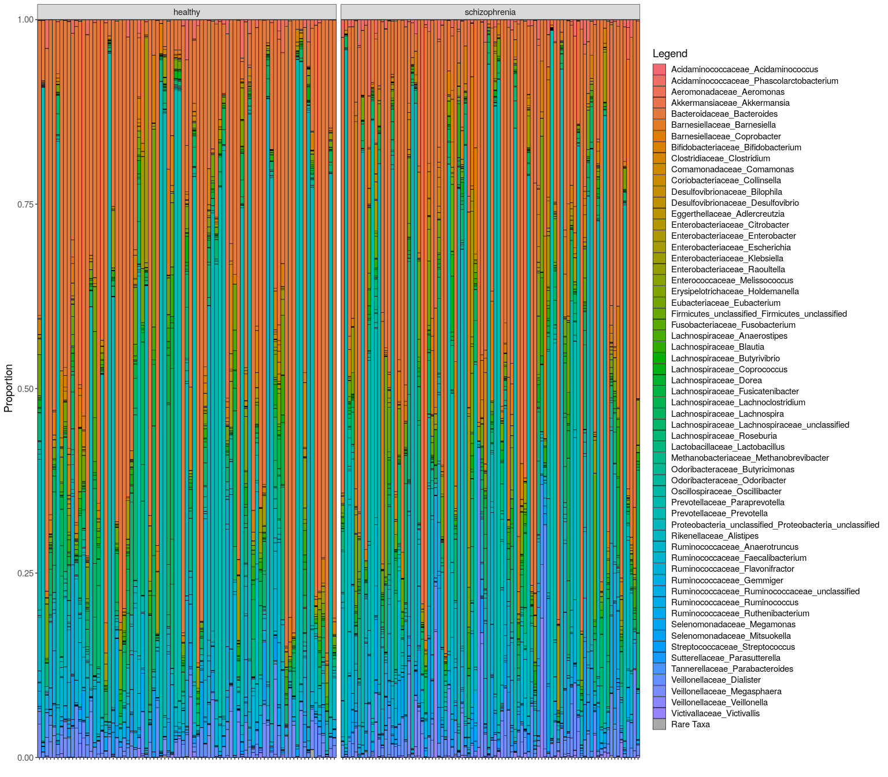<!-- -->
Stacked barplots are helpful because they allow us to *eyeball* the
data, giving us an idea of the experimental setup in the case of more
complex designs. They also allow us to get a general sense of the
effects we may expect and about the general levels of variance within
and between groups. In this case, nothing in particular stands out.
These samples look like they could have come from human microbiome
sequencing, which is exactly what we want!

------------------------------------------------------------------------

# 2. Alpha Diversity

Another staple in microbiome research is alpha diversity. In a nutshell,
alpha diversty is a set of measures that comment on how diverse,
complicated and/or rich a single sample is. The three most common
metrics for alpha diversity in microbiome research are Chao1, the
Simpson Index and Shannon Entropy.

### Code chunk: Computing and plotting Alpha diversity from a count table

``` r
#It is important to use the untouched count table here as we're interested in rare taxa.

#Compute alpha diversity using a wrapper around the iNEXT library, 
#which implements automatic rarefaction curves.
#This step can take some time. 

alpha_diversity = get_asymptotic_alpha(species = counts, verbose = FALSE) 

#Add metadata for plotting and stats. Make sure the count table and metadata match up!
alpha_diversity$Legend = metadata$Group
alpha_diversity$Sex    = metadata$Sex
alpha_diversity$Smoker = metadata$Smoker


#Plot alpha diversity all at once using pipes
alpha_diversity %>%

  #Wrangle the data to long format for easy plotting
  pivot_longer(!c(Legend, Sex, Smoker)) %>%

  #Pipe it all directly into ggplot2
  ggplot(aes(x      = Legend,
             y      = value, 
             fill   = Legend, 
             shape  = Sex, 
             group  = interaction(Legend, Sex))) + 
  
  #Let's use position_dodge() to visually separate males and females by group
  geom_boxplot(alpha = 1/2, coef = 100, position = position_dodge(1)) + 
  geom_beeswarm(size = 2, cex = 3, dodge.width = 1) + 
  facet_wrap(~name, scales = "free") + theme_bw()  +
  scale_fill_manual(values = c("healthy"        = "#fe9929", 
                               "schizophrenia"  = "#8c6bb1")) + 
  scale_shape_manual(values = c("female" = 21, 
                                "male"   = 22)) +  
  ylab("") + xlab("") 
```

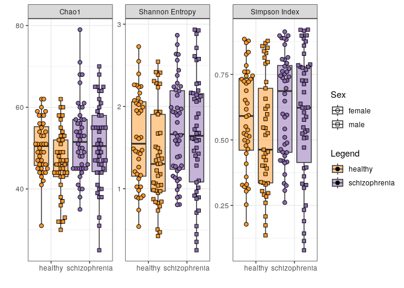<!-- -->

When eyeballing these figures, we might be able to spot an effect of
both sex and group. Note how in all three alpha diversity metrics the
female healthy volunteers seem to have a higher diversity than the
males. Nevertheless, after taking this sex effect into account, there is
still seems to be an effect of group. Rather than relying on eyeballing
though, statistical testing will help us determine what to say about
these results.

## 2.1 Testing for differences in Alpha diversity

Usually, one would use standard statistical tests such as t-tests and
ANOVAs to assess differences in alpha diversity metrics. However, since
we expect that smoking status and sex will also influence the
microbiome, we will here opt for a linear model approach to try and
account for the effect of sex and smoking status. We will generate
tables based on the fitting of these models. When interpreting these
tables, we are typically mainly interested in the **Estimate** column,
which is an estimate of the $\beta$ (beta), and the **Pr(\>\|t\|)**
column, which essentially depicts the p-values. In this case, the beta
of a group can be readily interpreted as the difference between the
means between the respective groups. Since we’ll be estimating a 95%
confidence interval as well, We’ll also get two columns with the 2.5%
and 97.5% points of the $\beta$ estimate. The top row, containing the
**(Intercept)** gives an estimation of the overall mean of the data and
can usually be ignored altogether, don’t get too excited if this has a
low p-value.

## 2.2 Reporting statistical models

According to the STROBE guidelines for observational studies, we should
report both the unadjusted model and the adjusted model, it is best
practice to do so. We will do so here in the alpha diversity section,
but for the sake of brevity we will skip this step for beta diversity
and differential abundance. In microbiome studies we typically assess a
very large number of features. Comprehensive statistical tables for
feature-wise tests will often find a home in the supplementary files.

### Code chunk: Testing for differences in Alpha diversity: Chao1

``` r
#Fit an unadjusted linear model
chao1_unadj = lm(Chao1 ~ Legend, alpha_diversity)

#Combine the summary of the model with the 95% confidence interval of the estimates
res_chao1_unadj = cbind(coefficients(summary(chao1_unadj)), confint(chao1_unadj))

#Plot the unadjusted results in a nice looking table
kable(res_chao1_unadj, digits = 3)
```

|                     | Estimate | Std. Error | t value | Pr(\>\|t\|) |  2.5 % | 97.5 % |
|:--------------------|---------:|-----------:|--------:|------------:|-------:|-------:|
| (Intercept)         |   48.383 |      0.981 |  49.298 |       0.000 | 46.445 | 50.320 |
| Legendschizophrenia |    3.084 |      1.353 |   2.280 |       0.024 |  0.413 |  5.755 |

``` r
#Fit a linear model with sex and smoking status as covariates
chao1_adj = lm(Chao1 ~ Legend + Sex + Smoker, alpha_diversity)

#Combine the summary of the model with the 95% confidence interval of the estimates
res_chao1_adj = cbind(coefficients(summary(chao1_adj)), confint(chao1_adj))

#Plot the adjusted results in a nice looking table
kable(res_chao1_adj, digits = 3)
```

|                     | Estimate | Std. Error | t value | Pr(\>\|t\|) |  2.5 % | 97.5 % |
|:--------------------|---------:|-----------:|--------:|------------:|-------:|-------:|
| (Intercept)         |   49.649 |      1.190 |  41.723 |       0.000 | 47.300 | 51.999 |
| Legendschizophrenia |    3.012 |      1.350 |   2.231 |       0.027 |  0.347 |  5.677 |
| Sexmale             |   -3.067 |      1.520 |  -2.018 |       0.045 | -6.067 | -0.066 |
| Smokeryes           |    1.157 |      1.686 |   0.686 |       0.494 | -2.172 |  4.487 |

### Code chunk: Testing for differences in Alpha diversity: Shannon Entropy

``` r
#Fit an unadjusted linear model
shann_unadj = lm(`Shannon Entropy` ~ Legend, alpha_diversity)

#Combine the summary of the model with the 95% confidence interval of the estimates
res_shann_unadj = cbind(coefficients(summary(shann_unadj)), confint(shann_unadj))

#Plot the unadjusted results in a nice looking table
kable(res_shann_unadj, digits = 3)
```

|                     | Estimate | Std. Error | t value | Pr(\>\|t\|) | 2.5 % | 97.5 % |
|:--------------------|---------:|-----------:|--------:|------------:|------:|-------:|
| (Intercept)         |    1.498 |      0.069 |  21.728 |        0.00 | 1.362 |  1.634 |
| Legendschizophrenia |    0.188 |      0.095 |   1.974 |        0.05 | 0.000 |  0.375 |

``` r
#Fit a linear model with sex and smoking status as covariates
shann_adj = lm(`Shannon Entropy` ~ Legend + Sex + Smoker, alpha_diversity)

#Combine the summary of the model with the 95% confidence interval of the estimates
res_shann_adj = cbind(coefficients(summary(shann_adj)), confint(shann_adj))

#Plot the adjusted results in a nice looking table
kable(res_shann_adj, digits = 3)
```

|                     | Estimate | Std. Error | t value | Pr(\>\|t\|) |  2.5 % | 97.5 % |
|:--------------------|---------:|-----------:|--------:|------------:|-------:|-------:|
| (Intercept)         |    1.567 |      0.084 |  18.633 |       0.000 |  1.401 |  1.734 |
| Legendschizophrenia |    0.189 |      0.095 |   1.986 |       0.049 |  0.001 |  0.378 |
| Sexmale             |   -0.128 |      0.107 |  -1.195 |       0.234 | -0.341 |  0.084 |
| Smokeryes           |   -0.017 |      0.119 |  -0.142 |       0.887 | -0.252 |  0.218 |

### Code chunk: Testing for differences in Alpha diversity: Simpson Index

``` r
#Fit an unadjusted linear model
simps_unadj = lm(`Simpson Index` ~ Legend, alpha_diversity)

#Combine the summary of the model with the 95% confidence interval of the estimates
res_simps_unadj = cbind(coefficients(summary(simps_unadj)), confint(simps_unadj))

#Plot the unadjusted results in a nice looking table
kable(res_simps_unadj, digits = 3)
```

|                     | Estimate | Std. Error | t value | Pr(\>\|t\|) |  2.5 % | 97.5 % |
|:--------------------|---------:|-----------:|--------:|------------:|-------:|-------:|
| (Intercept)         |    0.550 |      0.024 |  23.247 |       0.000 |  0.504 |  0.597 |
| Legendschizophrenia |    0.063 |      0.033 |   1.924 |       0.056 | -0.002 |  0.127 |

``` r
#Fit a linear model with sex and smoking status as covariates
simps_adj = lm(`Simpson Index` ~ Legend + Sex + Smoker, alpha_diversity)

#Combine the summary of the model with the 95% confidence interval of the estimates
res_simps_adj = cbind(coefficients(summary(simps_adj)), confint(simps_adj))

#Plot the adjusted results in a nice looking table
kable(res_simps_adj, digits = 3)
```

|                     | Estimate | Std. Error | t value | Pr(\>\|t\|) |  2.5 % | 97.5 % |
|:--------------------|---------:|-----------:|--------:|------------:|-------:|-------:|
| (Intercept)         |    0.576 |      0.029 |  19.986 |       0.000 |  0.519 |  0.633 |
| Legendschizophrenia |    0.063 |      0.033 |   1.939 |       0.054 | -0.001 |  0.128 |
| Sexmale             |   -0.049 |      0.037 |  -1.332 |       0.185 | -0.122 |  0.024 |
| Smokeryes           |   -0.005 |      0.041 |  -0.127 |       0.899 | -0.086 |  0.076 |

------------------------------------------------------------------------

# 3. Beta Diversity

Beta diversity can be thought of as the degree of difference between two
samples. Typically, Beta diversity is depicted using a 2d Principal
Component Analysis (PCA). We’ll perform the procedure and visualize the
results in a few different ways.

### Code chunk: Performing a Principal Component Analysis and plotting Beta diversity

``` r
#Apply the base R principal component analysis function on our CLR-transformed data.
data.a.pca  <- prcomp(t(genus.exp))

#Extract the amount of variance the first four components explain for plotting. 
pc1 <- round(data.a.pca$sdev[1]^2/sum(data.a.pca$sdev^2),4) * 100
pc2 <- round(data.a.pca$sdev[2]^2/sum(data.a.pca$sdev^2),4) * 100
pc3 <- round(data.a.pca$sdev[3]^2/sum(data.a.pca$sdev^2),4) * 100
pc4 <- round(data.a.pca$sdev[4]^2/sum(data.a.pca$sdev^2),4) * 100

#Extract the scores for every sample for the first four components for plotting. 
pca  = data.frame(PC1 = data.a.pca$x[,1], 
                  PC2 = data.a.pca$x[,2], 
                  PC3 = data.a.pca$x[,3], 
                  PC4 = data.a.pca$x[,4])

#Add relevant information from the metadata
pca$ID                  = metadata$master_ID
pca$Legend              = metadata$Group
pca$Sex                 = metadata$Sex
pca$Smoker              = metadata$Smoker

#First, the main plot. Plot the first two components of the PCA
mainbeta  <- ggplot(pca, aes(x       = PC1, 
                             y       = PC2, 
                             fill    = Legend,
                             colour  = Legend,
                             shape   = Sex, 
                             group   = Legend)) +  
  
  #Create the points and ellipses
  stat_ellipse(geom = "polygon", alpha = 1/4) +
  geom_point(size=3, col = "black") + 
  
  #Adjust appearance
  scale_fill_manual(values   = c("healthy" = "#fe9929", "schizophrenia" = "#8c6bb1")) + 
  scale_colour_manual(values = c("healthy" = "#fe9929", "schizophrenia" = "#8c6bb1")) + 
  scale_shape_manual(values  = c("female" = 21, "male"   = 22), guide = "none") +  
  guides(fill = guide_legend(override.aes = list(shape = c(21)))) +

  #Adjust labels
  ggtitle("Main") + 
  xlab(paste("PC1: ", pc1,  "%", sep="")) + 
  ylab(paste("PC2: ", pc2,  "%", sep="")) + 
  theme_bw() 

#Second, a smaller version to investigate the effect of sex. 
#Plot the first two components of the PCA
sexbeta   <- ggplot(pca, aes(x       = PC1, 
                             y       = PC2, 
                             fill    = Sex,
                             colour  = Sex,
                             shape   = Sex, 
                             group   = Sex)) +  
  
  #Create the points
  stat_ellipse(geom = "polygon", alpha = 1/4) +
  geom_point(size=2, col = "black") + 
  
  #Adjust appearance
  scale_fill_manual(values   = c("female" = "#fb9a99", "male" = "#a6cee3")) + 
  scale_colour_manual(values = c("female" = "#fb9a99", "male" = "#a6cee3")) +
  scale_shape_manual(values  = c("female" = 21, "male"   = 22)) +  
  
  #Adjust labels
  ggtitle("Sex") + xlab("") + ylab("") + theme_bw() 

#Third, a smaller version to investivate the effect of smoking.
#Plot the first two components of the PCA
smokebeta <- ggplot(pca, aes(x       = PC1, 
                             y       = PC2, 
                             fill    = Smoker,
                             colour  = Smoker,
                             shape   = Sex, 
                             group   = Smoker)) +  
  
  #Create the points
  stat_ellipse(geom = "polygon", alpha = 1/4) +
  geom_point(size=2, col = "black") + 
  
  #Adjust appearance
  scale_fill_manual(values   = c("yes" = "#ff7f00", "no" = "#33a02c")) +
  scale_colour_manual(values = c("yes" = "#ff7f00", "no" = "#33a02c")) +
  scale_shape_manual(values  = c("female" = 21, "male"   = 22), guide = "none") +   
  guides(fill = guide_legend(override.aes = list(shape = c(21)))) +

  #Adjust labels
  ggtitle("Smoker status") + xlab("") + ylab("") + theme_bw() 


#Use patchwork to compose the three plots
(mainbeta / (sexbeta | smokebeta)) + 
  plot_layout(guides = "collect", heights = c(3, 1))
```

<!-- -->

Here we see the first two components of our Principal Component
Analysis. This type of figure is often used as a visual aid when
assessing Beta diversity. We’ve also made two additional smaller
versions of the same data, filled in with our two covariates; sex and
smoking status, to help get an idea of the influence of those factors on
our data.

Even though we are only looking at the first, largest, two components,
this type of figure will often be called a Beta diversity plot. In this
case, as we used CLR-transformed data as a basis, it would be based on
Aitchison distance. Interpreting a Beta diversity plot for a microbiome
study like this one can seem daunting, but will quickly become fairly
straightforward. In a nutshell, every sample is depicted as a single
point. If two points are close together, this means that the samples are
more similar to each other. We can see that group, smoking status and
sex seem to be important in explaining what’s going on here.

These types of Beta diversity plots are also a useful way to detect
samples that are in some way *off*. If a sample is on the far side of
the PCA, this may be reason to inspect it further. Based on the amount
of reads and alpha diversity of the sample, one may even decide to
exclude it from the analysis as it may not reliably reflect your
population of interest.

Another thing to be on the lookout for are the axis values, depicting
the percentage of variance explained. Components that either explain a
huge amount of variance or large differences between the amount of
variance explained between the first two components can be an indication
something drastic is going on, like an antibiotics effect. Typically, we
expect the sizes of the components to follow a power law. In this case,
the axes look totally reasonable.

## 3.1 PERMANOVA

We can use a PERMANOVA test to investigate whether the variance in the
data can be explained by the group and sex they come from. Typically,
we’d say that we use a PERMANOVA to see whether the groups are different
from each other.

It is always a good idea to consider and check the assumptions and
vulnerabilities of a statistical test. PERMANOVA, like it’s univariate,
non-permutational cousin, ANOVA, make soft assumptions about the
dispersion per group (e.g. variance, distance from a group centroid)
being equal. Like ANOVA, PERMANOVA is also reasonably robust to small
differences in variance between groups. In a simulation study, PERMANOVA
was found to be overly conservative in the case of the larger group (by
N) has a greater dispersion, whereas it is overly permissive in the case
the smaller group (by N) has a larger dispersion.

### Code chunk: Preparing for PERMANOVA

``` r
#Display NAs as empty space in the table to improve appearance.
options(knitr.kable.NA = "")

#Compute euclidean distance over CLR-transformed values (i.e. Aitchison distance).
dis_ait = dist(t(genus.exp), method = "euclidean")

#Use the betadisper function to assess whether the groups have a difference in variance
beta_disp = betadisper(dis_ait, group = metadata$Group)

#Check average aitchison distance from the centroid 
beta_disp$group.distances
```

    ##       healthy schizophrenia 
    ##      18.33498      19.31644

``` r
#Run an ANOVA on the difference in variance per group, plot the results in a table
kable(anova(beta_disp), digits = 4)
```

|           |  Df |    Sum Sq | Mean Sq | F value | Pr(\>F) |
|:----------|----:|----------:|--------:|--------:|--------:|
| Groups    |   1 |   41.0655 | 41.0655 |  4.0635 |  0.0454 |
| Residuals | 169 | 1707.8987 | 10.1059 |         |         |

Here, we can see that while there is a significant difference in the
spreads per group, the difference is not very large: We see an average
distance to the centroid of 18.33 healthy controls vs 19 in
schizophrenia. Keeping this in mind, let’s perform a PERMANOVA.

### Code chunk: Performing a PERMANOVA test

``` r
#Perform a PERMANOVA (PERmutational Multivariate ANalysis Of VAriance) test.
PERMANOVA_res = adonis2(dis_ait ~ Group + Sex + Smoker, 
                        data = metadata, method = "euclidean", permutations = 1000)

#Plot the PERMANOVA results in a nice looking table
kable(PERMANOVA_res, digits = 4 )
```

|          |  Df |   SumOfSqs |     R2 |      F | Pr(\>F) |
|:---------|----:|-----------:|-------:|-------:|--------:|
| Group    |   1 |   872.4806 | 0.0138 | 2.3900 |   0.002 |
| Sex      |   1 |   721.8148 | 0.0114 | 1.9773 |   0.011 |
| Smoker   |   1 |   792.3537 | 0.0125 | 2.1705 |   0.003 |
| Residual | 167 | 60963.1982 | 0.9623 |        |         |
| Total    | 170 | 63349.8473 | 1.0000 |        |         |

In general, the most interesting columns from a PERMANOVA table like
this one are **R2**, which shows the amount of variance that can be
explained by the factor in that row, and **Pr(\>F)**, which can be
thought of as a p-value. We can see that the group but also the smoking
status and sex factors explain enough variance that we deem it unlikely
to have happened by chance (p \< 0.05). Thus, we can say we found a
group effect, a smoking effect and a sex effect. The effect are really
small though, both of them explain about 1% of all variance observed
which isn’t very much. This also tracks with our figures, where we could
see only mild differences for each factor. Importantly, because the
PERMANOVA is a permutation-based test, all test results will likely vary
slightly between runs. You could use the `set.seed()` function to ensure
consistency between runs, like we did in chapter 0.

------------------------------------------------------------------------

# 4. Differential Abundance

Differential abundance testing is an integral part of microbiome
studies. here we check whether individual features, be they taxa or
functions, are present in different abundances between groups.

## 4.1 Genera

Differential abundance of taxa, in this case genera, are perhaps the
most common part of a microbiome study.

### Code chunk: Testing for differentially abundant genera and plotting the results

``` r
#This function fits the equivalent of lm(feature ~ Group + Sex + Smoker) for each feature.
#It also performs an appropriate Benjamini-Hochberg correction on the p-values. 

genus.glm = fw_glm(x             = genus.exp,
                   f             = ~ Group + Sex + Smoker, 
                   metadata      = metadata, 
                   adjust.method = "BH", format = "brief")
```

    ## [1] "Using the following formula: x ~ Group + Sex + Smoker"
    ## [1] "Adjusting for FDR using Benjamini & Hochberg's procedure."

``` r
#(genus.glm, file = "genus.glm.csv") #To save the results to a file. 
```

------------------------------------------------------------------------

Before we proceed with the demonstration, let’s take a quick peek at the
output of this function:

``` r
glimpse(genus.glm)
```

    ## Rows: 84
    ## Columns: 10
    ## $ feature                          <chr> "Acidaminococcaceae_Phascolarctobacte…
    ## $ `Groupschizophrenia Estimate`    <dbl> 0.38645474, 0.23365778, 1.72428829, 0…
    ## $ `Groupschizophrenia Pr(>|t|)`    <dbl> 3.290809e-01, 2.766298e-01, 4.349376e…
    ## $ `Sexmale Estimate`               <dbl> 0.485194237, 0.181234364, -0.32451485…
    ## $ `Sexmale Pr(>|t|)`               <dbl> 0.2766350, 0.4531579, 0.4837235, 0.88…
    ## $ `Smokeryes Estimate`             <dbl> -0.18867208, 0.65548364, 0.02917598, …
    ## $ `Smokeryes Pr(>|t|)`             <dbl> 0.70254279, 0.01527056, 0.95471101, 0…
    ## $ `Groupschizophrenia Pr(>|t|).BH` <dbl> 0.537383182, 0.523552585, 0.003653476…
    ## $ `Sexmale Pr(>|t|).BH`            <dbl> 0.7524988, 0.8275057, 0.8417461, 0.96…
    ## $ `Smokeryes Pr(>|t|).BH`          <dbl> 0.8930102, 0.1483272, 0.9547110, 0.37…

The output is a `data.frame` with the input features as rows and the
estimates of betas, p-values and adjusted p-values as columns. This is
all direct output from the `lm()` fits that were run under the hood. If
we hadn’t specified `format = "brief"`, we’d also receive the standard
error of the estimate and the corresponding t-statistic used to
calculate a p-value. It is always a good idea to investigate the output
of any bioinformatics pipeline.

Now, let’s proceed with the demonstration.

------------------------------------------------------------------------

It is best practice to investigate the distribution of p-values using a
histogram.

``` r
hist(genus.glm$`Groupschizophrenia Pr(>|t|)`, xlim = c(0, 1), breaks = 20)
```

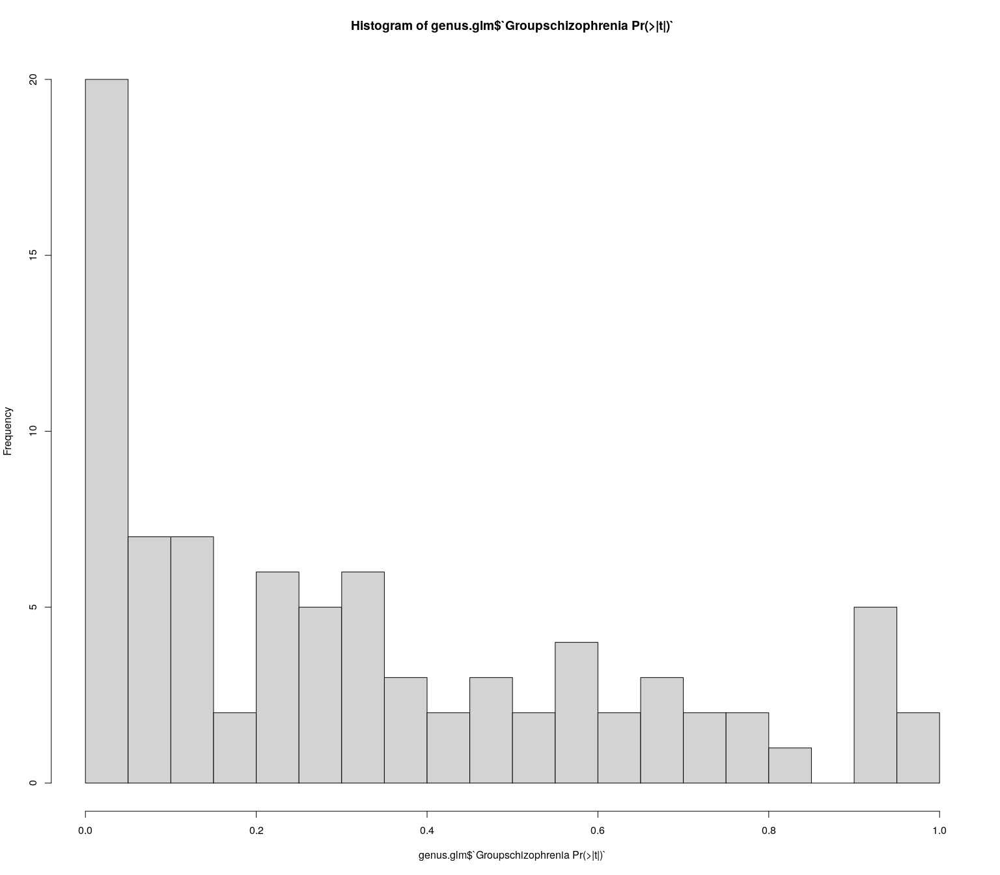<!-- -->

Histograms of p-values are useful to assess whether there is something
fishy going on in your data. Broadly speaking, one would typically
expect some features to be altered based on a condition (null hypothesis
is false; H<sub>1</sub>) and some others to not be affected by the
condition (null hypothesis is true; H<sub>0</sub>). The p-value was
designed in such a way that in the case of a true H<sub>0</sub>, the
p-values will be uniformly distributed from 0 - 1. Conversely, in the
case of H<sub>1</sub>, the p-values will typically aggregate close to 0.
Normally, we would expect a combination of these two patterns in our
histogram. So we would want to see a low density of p-values form 0 - 1
with a nice peak around 0 indicating some differences between our
groups. This also means that if the p-value histogram is ever overly
‘lumpy’ at a value other than 0, this is an indication that something
fishy is going on and that you should try to find out why this is the
case. Sometimes, this can happen when using one-tailed tests or when the
individual features are heavily dependent on each other.

In this case, the p-value distribution looks fine. We can see that there
is a peak on the left. There are many p-values under 0.05. There is a
group effect here.

Check the distribution of Benjamini-Hochberg corrected p-values to get a
sense of the results. This is not strictly necessary, but it can be
helpful to get a sense of how your p-values were affected by the
post-hoc correction and how many figures to expect.

``` r
hist(genus.glm$`Groupschizophrenia Pr(>|t|).BH`, xlim = c(0, 1), breaks = 20)
```

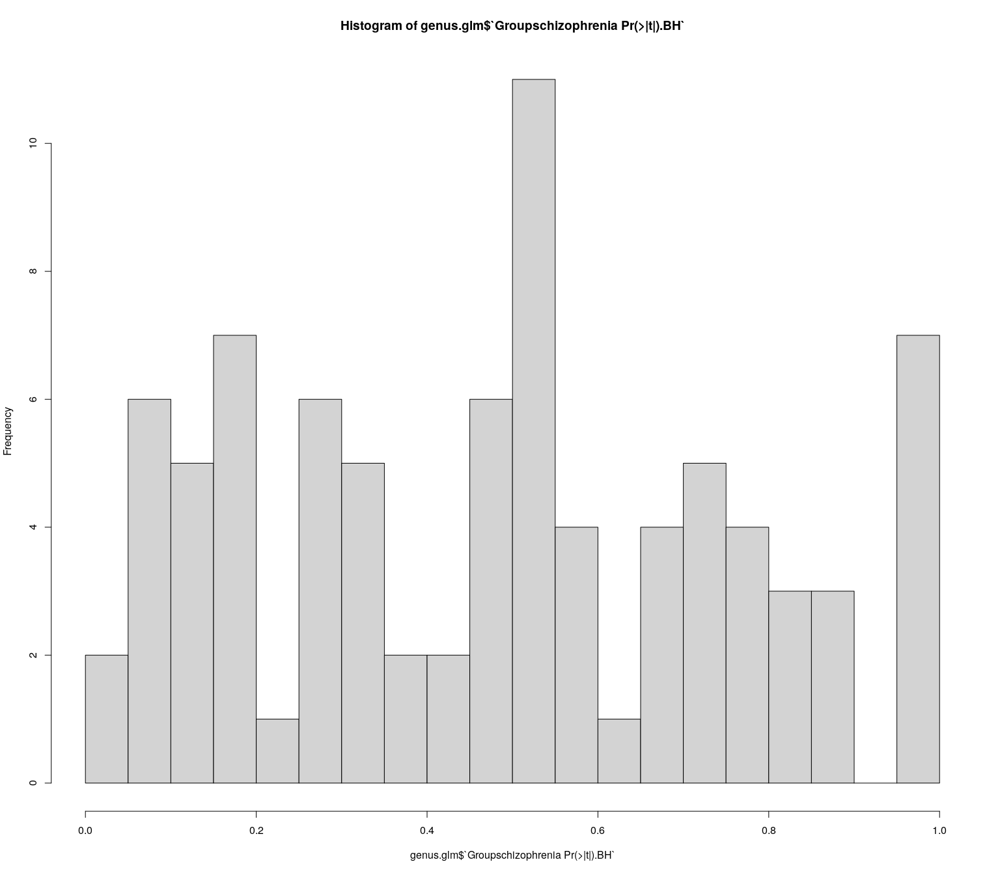<!-- -->

Using a fairly standard cutoff of q \< 0.1 we see a fair amount of
significant differences.

``` r
#Plot the features that show a group effect at q < 0.1
genBH <- genus.exp[genus.glm[genus.glm$`Groupschizophrenia Pr(>|t|).BH` < 0.1,"feature"],]

genBH %>%
  t() %>%
  as.data.frame() %>%
  add_column(Group = metadata$Group, 
             Sex   = metadata$Sex)  %>%
  pivot_longer(!c("Group", "Sex"))  %>%
  mutate(name = str_replace(name, ".*ales_", "")) %>% 
  ggplot(aes(x     = Group, 
             y     = value, 
             fill  = Group, 
             shape = Sex, 
             group = Group)) + 
  geom_boxplot(alpha = 1/2, coef = 100) +
  geom_beeswarm(size = 3, cex = 3) + 
  
  facet_wrap(~name, scales = "free_y", ncol = 4) +
  scale_fill_manual(  values = c("healthy"  = "#fe9929", 
                                 "schizophrenia" = "#8c6bb1")) + 
  scale_shape_manual(values = c("female" = 21, 
                                "male" = 22)) +  
  ylab("") + xlab("") + theme_bw() + theme(text = element_text(size = 12))
```

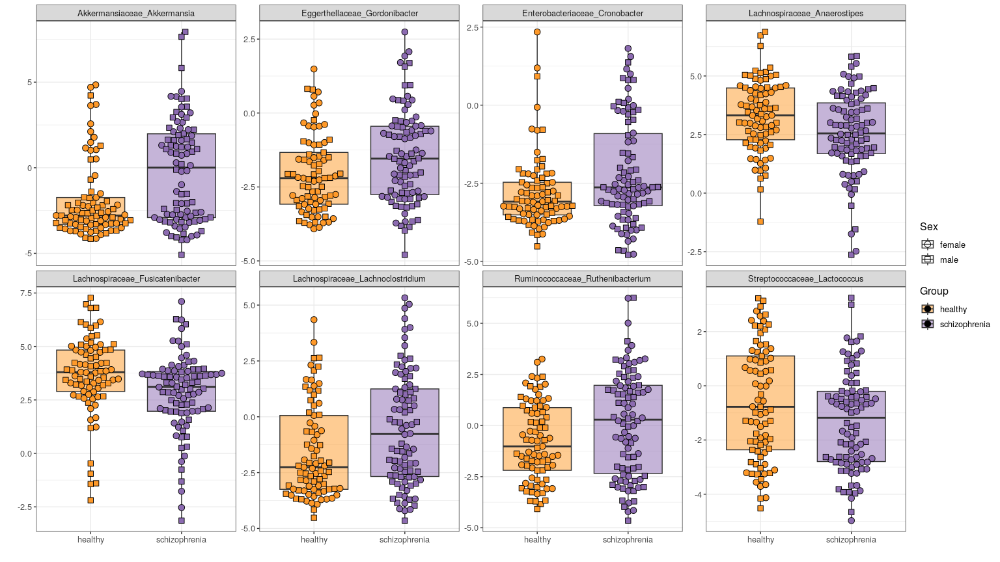<!-- -->

``` r
#write.csv(genus.glm, "genus.glm.csv") #To save the results to a file. 
```

It seems eight genera are significantly differential abundant between
our healthy and schizophrenia groups given the q \< 0.1 threshold. Note
that the y-axis depicts CLR-transformed abundance.

## 4.2 Functional Modules

Functional modules provide many advantages over taxa when it comes to
differential abundance analysis. Perhaps prime among them, they are
easier to interpret as they cover concrete molecular processes rather
than the abundance of a microbe that may not be characterized.

### Code chunk: Load the Gut Brain Modules and prepare them for analysis

``` r
#Ensure reproducibility within this document
set.seed(1)

#Load GBMS like we did with the genus-level counts and metadata above. 
GBMs <- GBMs

#Make sure our count data is all numbers
GBMs   <- apply(GBMs,c(1,2),function(x) as.numeric(as.character(x)))

#Remove features with prevalence < 10% in two steps:
#First, determine how often every feature is absent in a sample
n_zeroes_GBMs <- rowSums(GBMs == 0)

#Then, remove features that are absent in more than your threshold (90% in this case).
GBMs    <- GBMs[n_zeroes_GBMs <= round(ncol(GBMs) * 0.90),]  

#Perform a CLR transformation
GBMs.exp <- clr_c(GBMs)

#Reorder the CLR-transformed feature table to match the metadata
GBMs.exp = GBMs.exp[,metadata$master_ID]

#This function fits the equivalent of lm(feature ~ Group + Sex + Smoker) for each feature.
#It also performs an appropriate Benjamini-Hochberg correction on the p-values. 
GBMs.glm =  fw_glm(x             = GBMs.exp,
                   f             = ~ Group + Sex + Smoker, 
                   metadata      = metadata, 
                   adjust.method = "BH")
```

    ## [1] "Using the following formula: x ~ Group + Sex + Smoker"
    ## [1] "Adjusting for FDR using Benjamini & Hochberg's procedure."

It is best practice to investigate the distribution of p-values using a
histogram.

``` r
hist(GBMs.glm$`Groupschizophrenia Pr(>|t|)`, xlim = c(0, 1), breaks = 20)
```

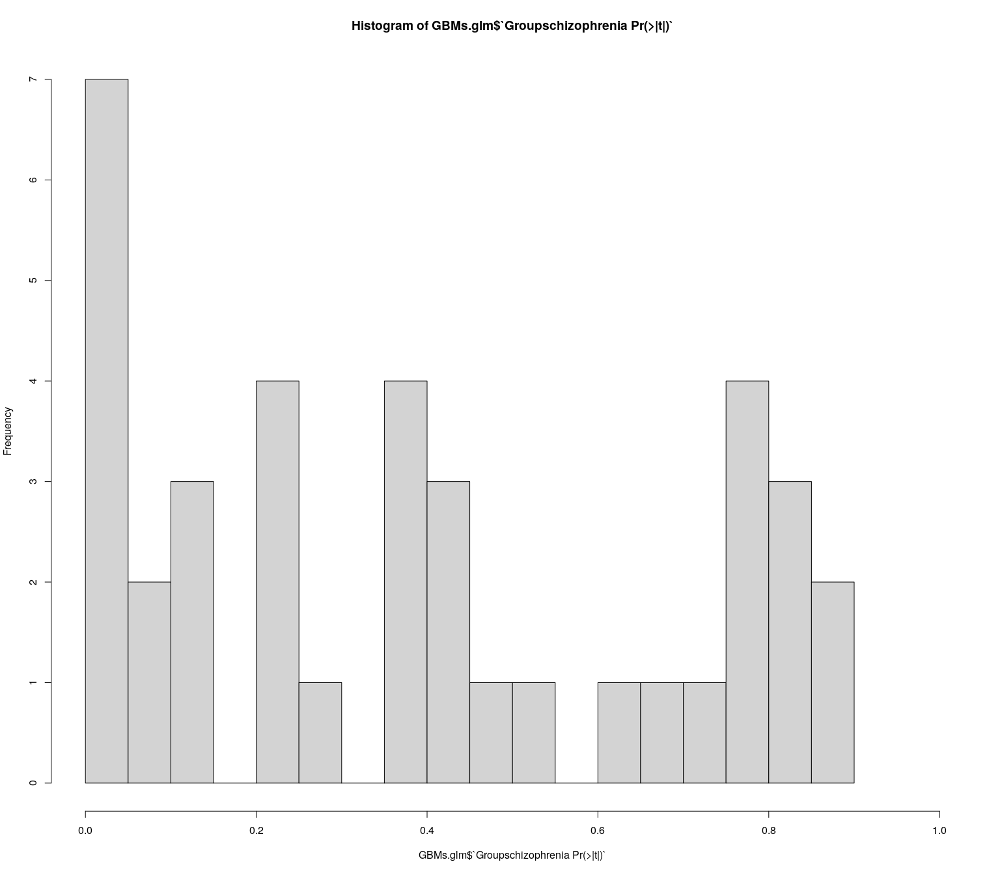<!-- -->

Histograms of p-values are useful to assess whether there is something
fishy going on in your data. Broadly speaking, one would typically
expect some features to be altered based on a condition (null hypothesis
is false; H<sub>1</sub>) and some others to not be affected by the
condition (null hypothesis is true; H<sub>0</sub>). The p-value was
designed in such a way that in the case of a true H<sub>0</sub>, the
p-values will be uniformly distributed from 0 - 1. Conversely, in the
case of H<sub>1</sub>, the p-values will typically aggregate close to 0.
Normally, we would expect a combination of these two patterns in our
histogram. So we would want to see a low density of p-values form 0 - 1
with a nice peak around 0 indicating some differences between our
groups. This also means that if the p-value histogram is ever overly
‘lumpy’ at a value other than 0, this is an indication that something
fishy is going on and that you should try to find out why this is the
case. Sometimes, this can happen when using one-tailed tests or when the
individual features are heavily dependent on each other.

In this case, the p-value distribution looks fine. We can see that there
is a peak on the left. There are many p-values under 0.05. There is a
group effect here.

Check the distribution of Benjamini-Hochberg corrected p-values to get a
sense of the results. This is not strictly necessary, but it can be
helpful to get a sense of how your p-values were affected by the
post-hoc correction and how many figures to expect.

``` r
hist(GBMs.glm$`Groupschizophrenia Pr(>|t|).BH`, xlim = c(0, 1), breaks = 20)
```

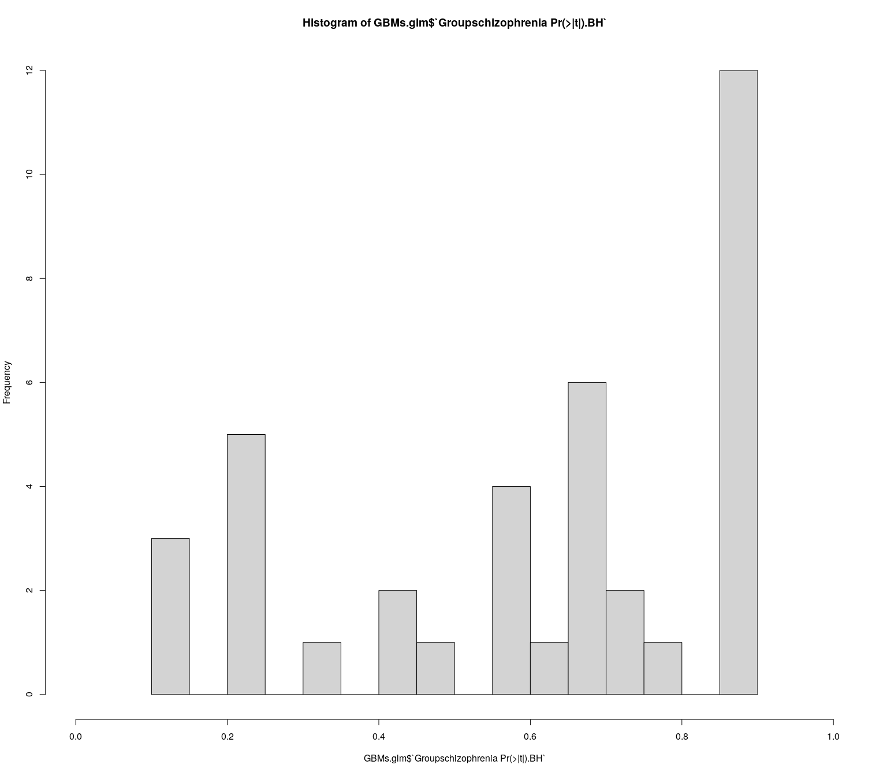<!-- --> Using a
fairly standard cutoff of q \< 0.2 we see a few hits.

### Code chunk: Plot the differentially abundant Gut Brain modules

``` r
#Plot the features that show a group effect at q < 0.2
GBM_BH <- GBMs.exp[GBMs.glm[GBMs.glm$`Groupschizophrenia Pr(>|t|).BH` < 0.2,"feature"],] 

GBM_BH %>%
  t() %>%
  as.data.frame() %>%
  add_column(Group = metadata$Group, 
             Sex   = metadata$Sex)  %>%
  pivot_longer(!c("Group", "Sex"))  %>%
  mutate(name = str_replace(name, ".*ales_", "")) %>% 
  ggplot(aes(x     = Group, 
             y     = value, 
             fill  = Group, 
             shape = Sex, 
             group = Group)) + 
  geom_boxplot(alpha = 1/2, coef = 100) +
  geom_beeswarm(size = 3, cex = 3) + 
  
  facet_wrap(~name, scales = "free_y", ncol = 3) +
  scale_fill_manual(  values = c("healthy"  = "#fe9929", 
                                 "schizophrenia" = "#8c6bb1")) + 
  scale_shape_manual(values = c("female" = 21, 
                                "male" = 22)) +  
  ylab("") + xlab("") + theme_bw() + theme(text = element_text(size = 12))
```

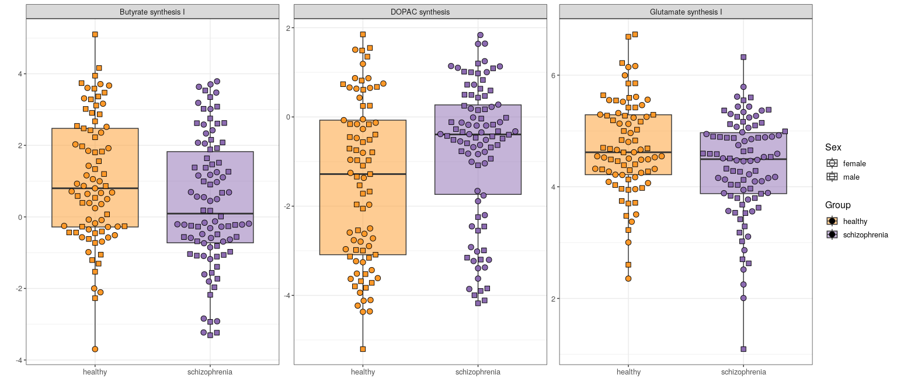<!-- -->

``` r
#write.csv(GBMs.glm, "GBMs.glm.csv") #To save the results to a file. 
```

### Code chunk: Load the Gut Metabolic Modules and prepare them for analysis

``` r
#Ensure reproducibility within this document
set.seed(1)

#Load GBMS like we did with the genus-level counts and metadata above. 
GMMs <- GMMs

#Make sure our count data is all numbers
GMMs   <- apply(GMMs,c(1,2),function(x) as.numeric(as.character(x)))


#Remove features with prevalence < 10% in two steps:
#First, determine how often every feature is absent in a sample
n_zeroes_GMMs <- rowSums(GMMs == 0)

#Then, remove features that are absent in more than your threshold (90% in this case).
GMMs    <- GMMs[n_zeroes_GMMs <= round(ncol(GMMs) * 0.90),]   

#Perform a CLR transformation
GMMs.exp <- clr_c(GMMs)

#Reorder the CLR-transformed feature table to match the metadata
GMMs.exp = GMMs.exp[,metadata$master_ID]

#This function fits the equivalent of lm(feature ~ Group + Sex + Smoker) for each feature.
#It also performs an appropriate Benjamini-Hochberg correction on the p-values. 
GMMs.glm =  fw_glm(x             = GMMs.exp,
                   f             = ~ Group + Sex + Smoker, 
                   metadata      = metadata, 
                   adjust.method = "BH")
```

    ## [1] "Using the following formula: x ~ Group + Sex + Smoker"
    ## [1] "Adjusting for FDR using Benjamini & Hochberg's procedure."

It is best practice to investigate the distribution of p-values using a
histogram.

``` r
hist(GMMs.glm$`Groupschizophrenia Pr(>|t|)`, xlim = c(0, 1), breaks = 20)
```

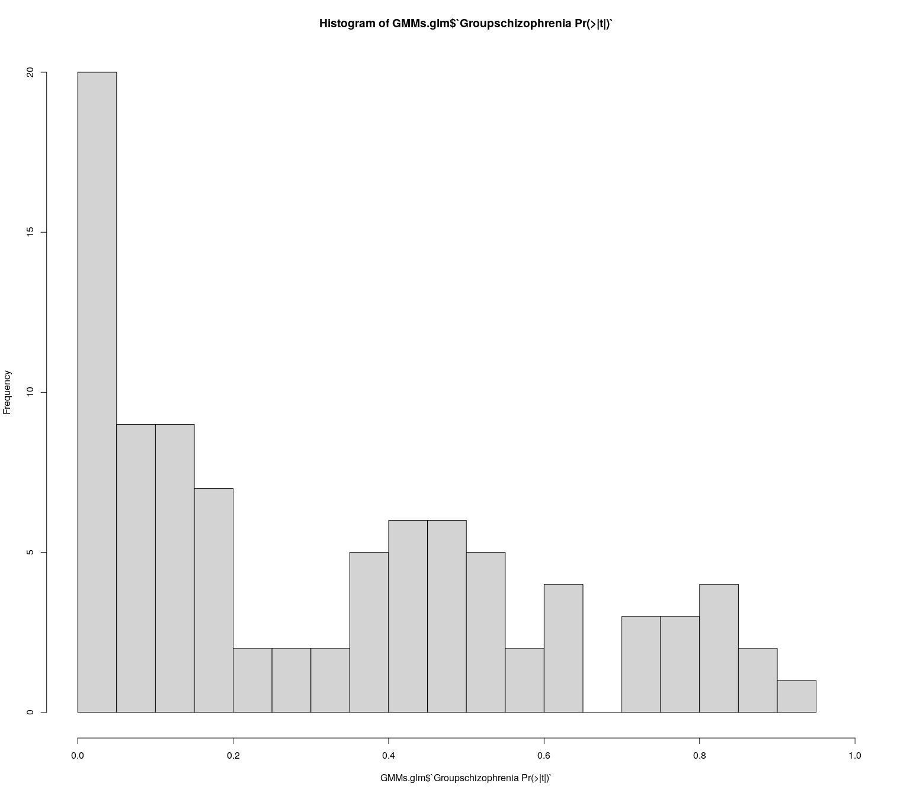<!-- -->

Histograms of p-values are useful to assess whether there is something
fishy going on in your data. Broadly speaking, one would typically
expect some features to be altered based on a condition (null hypothesis
is false; H<sub>1</sub>) and some others to not be affected by the
condition (null hypothesis is true; H<sub>0</sub>). The p-value was
designed in such a way that in the case of a true H<sub>0</sub>, the
p-values will be uniformly distributed from 0 - 1. Conversely, in the
case of H<sub>1</sub>, the p-values will typically aggregate close to 0.
Normally, we would expect a combination of these two patterns in our
histogram. So we would want to see a low density of p-values form 0 - 1
with a nice peak around 0 indicating some differences between our
groups. This also means that if the p-value histogram is ever overly
‘lumpy’ at a value other than 0, this is an indication that something
fishy is going on and that you should try to find out why this is the
case. Sometimes, this can happen when using one-tailed tests or when the
individual features are heavily dependent on each other.

In this case, the p-value distribution looks fine. We can see that there
is a peak on the left. There are many p-values under 0.05. There is a
group effect here.

Check the distribution of Benjamini-Hochberg corrected p-values to get a
sense of the results. This is not strictly necessary, but it can be
helpful to get a sense of how your p-values were affected by the
post-hoc correction and how many figures to expect.

``` r
hist(GMMs.glm$`Groupschizophrenia Pr(>|t|).BH`, xlim = c(0, 1), breaks = 20)
```

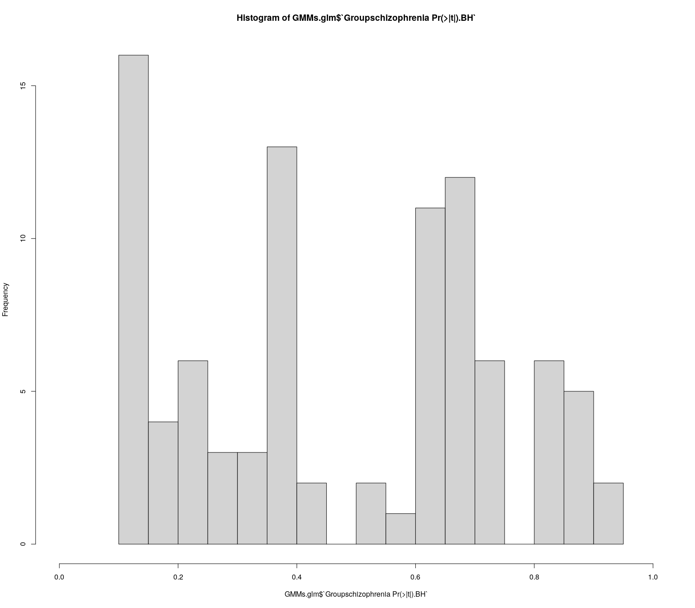<!-- -->

Using a fairly standard cutoff of q \< 0.2 we see a fair amount of
significant differences.

### Code chunk: Plot the differentially abundant Gut Metabolic module

``` r
#Plot the features that show a group effect at q < 0.2
GMM_BH <- GMMs.exp[GMMs.glm[GMMs.glm$`Groupschizophrenia Pr(>|t|).BH` < 0.2,"feature"],] 

GMM_BH %>%
  t() %>%
  as.data.frame() %>%
  add_column(Group = metadata$Group, 
             Sex   = metadata$Sex)  %>%
  pivot_longer(!c("Group", "Sex"))  %>%
  mutate(name = str_replace(name, ".*ales_", "")) %>% 
  ggplot(aes(x     = Group, 
             y     = value, 
             fill  = Group, 
             shape = Sex, 
             group = Group)) + 
  geom_boxplot(alpha = 1/2, coef = 100) +
  geom_beeswarm(size = 3, cex = 3) + 
  
  facet_wrap(~name, scales = "free_y", ncol = 4) +
  scale_fill_manual(  values = c("healthy"  = "#fe9929", 
                                 "schizophrenia" = "#8c6bb1")) + 
  scale_shape_manual(values = c("female" = 21, 
                                "male" = 22)) +  
  ylab("") + xlab("") + theme_bw() + theme(text = element_text(size = 12))
```

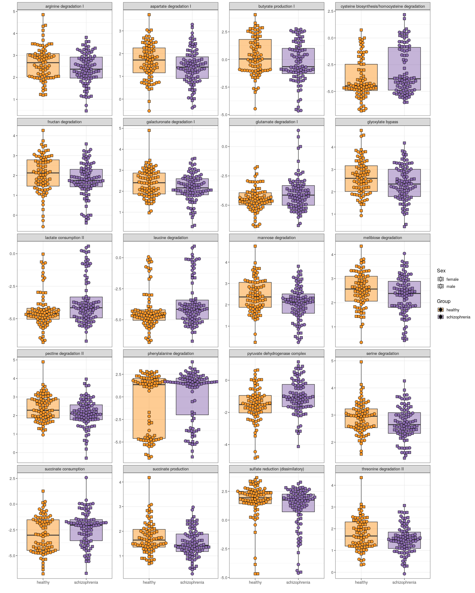<!-- -->

``` r
#write.csv(GMMs.glm, "GMMs.glm.csv") #To save the results to a file. 
```

------------------------------------------------------------------------

# 5. Discussion

Here, we have presented what a fairly standard microbiome analysis might
look like. The main points we would take from the analysis would be that
there is indeed a difference in the microbiome between our cohort of
patients with schizophrenia and healthy volunteers, in terms of
composition (beta diversity), diversity (alpha diversity) as well as in
differential feature abundance, both on the taxonomical level as well as
the functional level. We could then go on and comment on what specific
functions in the microbiome may explain the differences in our cohort.
For instance, differences in the metabolism of DOPAC and glutamate,
precursor molecules for the important neurotransmitters dopamine and
GABA, could be pointed out and compared to literature. In our
limitations section, we would stress that the effect sizes we found were
quite small and that we found an effect of smoking and of sex as well.

Of course, this document is just a template. Depending on the
experimental setup, findings and experimental questions, you may want to
choose a differing approach. Given the highly complex nature of
microbiome data, one should ideally avoid blindly applying models and
pipelines without understanding what they are doing. D.R. Cox is
famously ascribed the statement: *“Most real life statistical problems
have one or more nonstandard features. There are no routine statistical
questions; only questionable statistical routines.”* We find this holds
true for the microbiome as well.

Clear communication, both in terms of describing and explaining our
methods as well as in terms of figure presentation, are essential for
the health of the field. Indeed, failing to do so can lead to confusion
among our peers. We hope that both aspiring and veteran
bioinformaticians will find our guide helpful. We have tried to model
this piece after what we would have loved to have access to ourselves
when we first set out to study the microbiome.

------------------------------------------------------------------------

# Session Info

``` r
sessioninfo::session_info()
```

    ## ─ Session info ───────────────────────────────────────────────────────────────
    ##  setting  value
    ##  version  R version 4.2.2 Patched (2022-11-10 r83330)
    ##  os       Ubuntu 18.04.6 LTS
    ##  system   x86_64, linux-gnu
    ##  ui       X11
    ##  language en_IE:en
    ##  collate  en_IE.UTF-8
    ##  ctype    en_IE.UTF-8
    ##  tz       Europe/Dublin
    ##  date     2023-07-18
    ##  pandoc   2.19.2 @ /usr/lib/rstudio/resources/app/bin/quarto/bin/tools/ (via rmarkdown)
    ## 
    ## ─ Packages ───────────────────────────────────────────────────────────────────
    ##  package       * version  date (UTC) lib source
    ##  abind           1.4-5    2016-07-21 [1] CRAN (R 4.2.0)
    ##  assertthat      0.2.1    2019-03-21 [1] CRAN (R 4.2.0)
    ##  backports       1.4.1    2021-12-13 [1] CRAN (R 4.2.0)
    ##  beeswarm        0.4.0    2021-06-01 [1] CRAN (R 4.2.0)
    ##  broom           1.0.2    2022-12-15 [1] CRAN (R 4.2.1)
    ##  car             3.0-13   2022-05-02 [1] CRAN (R 4.2.0)
    ##  carData         3.0-5    2022-01-06 [1] CRAN (R 4.2.0)
    ##  cellranger      1.1.0    2016-07-27 [1] CRAN (R 4.2.0)
    ##  cli             3.6.0    2023-01-09 [1] CRAN (R 4.2.1)
    ##  cluster         2.1.4    2022-08-22 [4] CRAN (R 4.2.1)
    ##  colorspace      2.0-3    2022-02-21 [1] CRAN (R 4.2.0)
    ##  crayon          1.5.2    2022-09-29 [1] CRAN (R 4.2.1)
    ##  DBI             1.1.3    2022-06-18 [1] CRAN (R 4.2.0)
    ##  dbplyr          2.3.0    2023-01-16 [1] CRAN (R 4.2.1)
    ##  digest          0.6.31   2022-12-11 [1] CRAN (R 4.2.1)
    ##  dplyr         * 1.0.10   2022-09-01 [1] CRAN (R 4.2.1)
    ##  ellipsis        0.3.2    2021-04-29 [1] CRAN (R 4.2.0)
    ##  evaluate        0.20     2023-01-17 [1] CRAN (R 4.2.1)
    ##  fansi           1.0.3    2022-03-24 [1] CRAN (R 4.2.0)
    ##  farver          2.1.1    2022-07-06 [1] CRAN (R 4.2.1)
    ##  fastmap         1.1.0    2021-01-25 [1] CRAN (R 4.2.0)
    ##  forcats       * 0.5.2    2022-08-19 [1] CRAN (R 4.2.1)
    ##  fs              1.5.2    2021-12-08 [1] CRAN (R 4.2.0)
    ##  gargle          1.2.1    2022-09-08 [1] CRAN (R 4.2.1)
    ##  generics        0.1.3    2022-07-05 [1] CRAN (R 4.2.1)
    ##  ggbeeswarm    * 0.7.1    2022-12-16 [1] CRAN (R 4.2.1)
    ##  ggforce       * 0.4.1    2022-10-04 [1] CRAN (R 4.2.1)
    ##  ggplot2       * 3.4.0    2022-11-04 [1] CRAN (R 4.2.1)
    ##  glue            1.6.2    2022-02-24 [1] CRAN (R 4.2.0)
    ##  googledrive     2.0.0    2021-07-08 [1] CRAN (R 4.2.0)
    ##  googlesheets4   1.0.1    2022-08-13 [1] CRAN (R 4.2.1)
    ##  gtable          0.3.1    2022-09-01 [1] CRAN (R 4.2.1)
    ##  haven           2.5.1    2022-08-22 [1] CRAN (R 4.2.1)
    ##  highr           0.10     2022-12-22 [1] CRAN (R 4.2.1)
    ##  hms             1.1.2    2022-08-19 [1] CRAN (R 4.2.1)
    ##  htmltools       0.5.4    2022-12-07 [1] CRAN (R 4.2.1)
    ##  httr            1.4.4    2022-08-17 [1] CRAN (R 4.2.1)
    ##  iNEXT         * 3.0.0    2022-08-29 [1] CRAN (R 4.2.1)
    ##  jsonlite        1.8.4    2022-12-06 [1] CRAN (R 4.2.1)
    ##  knitr         * 1.41     2022-11-18 [1] CRAN (R 4.2.1)
    ##  labeling        0.4.2    2020-10-20 [1] CRAN (R 4.2.0)
    ##  lattice       * 0.20-45  2021-09-22 [4] CRAN (R 4.2.0)
    ##  lifecycle       1.0.3    2022-10-07 [1] CRAN (R 4.2.1)
    ##  lubridate       1.9.0    2022-11-06 [1] CRAN (R 4.2.1)
    ##  magrittr        2.0.3    2022-03-30 [1] CRAN (R 4.2.0)
    ##  MASS            7.3-58.2 2023-01-23 [4] CRAN (R 4.2.2)
    ##  Matrix          1.5-3    2022-11-11 [1] CRAN (R 4.2.1)
    ##  metafolio     * 0.1.1    2022-04-11 [1] CRAN (R 4.2.0)
    ##  mgcv            1.8-41   2022-10-21 [4] CRAN (R 4.2.1)
    ##  modelr          0.1.10   2022-11-11 [1] CRAN (R 4.2.1)
    ##  munsell         0.5.0    2018-06-12 [1] CRAN (R 4.2.0)
    ##  nlme            3.1-162  2023-01-31 [4] CRAN (R 4.2.2)
    ##  patchwork     * 1.1.2    2022-08-19 [1] CRAN (R 4.2.1)
    ##  permute       * 0.9-7    2022-01-27 [1] CRAN (R 4.2.0)
    ##  pillar          1.8.1    2022-08-19 [1] CRAN (R 4.2.1)
    ##  pkgconfig       2.0.3    2019-09-22 [1] CRAN (R 4.2.0)
    ##  plyr            1.8.8    2022-11-11 [1] CRAN (R 4.2.1)
    ##  polyclip        1.10-4   2022-10-20 [1] CRAN (R 4.2.1)
    ##  purrr         * 1.0.1    2023-01-10 [1] CRAN (R 4.2.1)
    ##  R6              2.5.1    2021-08-19 [1] CRAN (R 4.2.0)
    ##  Rcpp            1.0.9    2022-07-08 [1] CRAN (R 4.2.1)
    ##  readr         * 2.1.3    2022-10-01 [1] CRAN (R 4.2.1)
    ##  readxl          1.4.1    2022-08-17 [1] CRAN (R 4.2.1)
    ##  reprex          2.0.2    2022-08-17 [1] CRAN (R 4.2.1)
    ##  reshape2        1.4.4    2020-04-09 [1] CRAN (R 4.2.0)
    ##  rlang           1.0.6    2022-09-24 [1] CRAN (R 4.2.1)
    ##  rmarkdown       2.20     2023-01-19 [1] CRAN (R 4.2.1)
    ##  rstudioapi      0.14     2022-08-22 [1] CRAN (R 4.2.1)
    ##  rvest           1.0.3    2022-08-19 [1] CRAN (R 4.2.1)
    ##  scales          1.2.1    2022-08-20 [1] CRAN (R 4.2.1)
    ##  sessioninfo     1.2.2    2021-12-06 [1] CRAN (R 4.2.0)
    ##  stringi         1.7.12   2023-01-11 [1] CRAN (R 4.2.1)
    ##  stringr       * 1.5.0    2022-12-02 [1] CRAN (R 4.2.1)
    ##  tibble        * 3.1.8    2022-07-22 [1] CRAN (R 4.2.1)
    ##  tidyr         * 1.2.1    2022-09-08 [1] CRAN (R 4.2.1)
    ##  tidyselect      1.2.0    2022-10-10 [1] CRAN (R 4.2.1)
    ##  tidyverse     * 1.3.2    2022-07-18 [1] CRAN (R 4.2.1)
    ##  timechange      0.2.0    2023-01-11 [1] CRAN (R 4.2.1)
    ##  Tjazi         * 0.1.0.0  2023-04-26 [1] Github (thomazbastiaanssen/Tjazi@91f5c82)
    ##  tweenr          2.0.2    2022-09-06 [1] CRAN (R 4.2.1)
    ##  tzdb            0.3.0    2022-03-28 [1] CRAN (R 4.2.0)
    ##  utf8            1.2.2    2021-07-24 [1] CRAN (R 4.2.0)
    ##  vctrs           0.5.1    2022-11-16 [1] CRAN (R 4.2.1)
    ##  vegan         * 2.6-4    2022-10-11 [1] CRAN (R 4.2.1)
    ##  vipor           0.4.5    2017-03-22 [1] CRAN (R 4.2.0)
    ##  waldo         * 0.4.0    2022-03-16 [1] CRAN (R 4.2.0)
    ##  withr           2.5.0    2022-03-03 [1] CRAN (R 4.2.0)
    ##  xfun            0.36     2022-12-21 [1] CRAN (R 4.2.1)
    ##  xml2            1.3.3    2021-11-30 [1] CRAN (R 4.2.0)
    ##  yaml            2.3.6    2022-10-18 [1] CRAN (R 4.2.1)
    ## 
    ##  [1] /home/thomaz/R/x86_64-pc-linux-gnu-library/4.2
    ##  [2] /usr/local/lib/R/site-library
    ##  [3] /usr/lib/R/site-library
    ##  [4] /usr/lib/R/library
    ## 
    ## ──────────────────────────────────────────────────────────────────────────────
