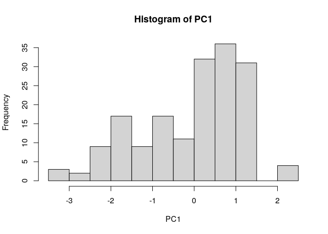
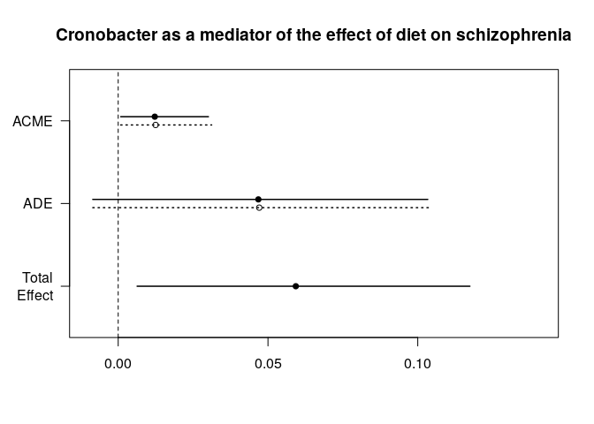
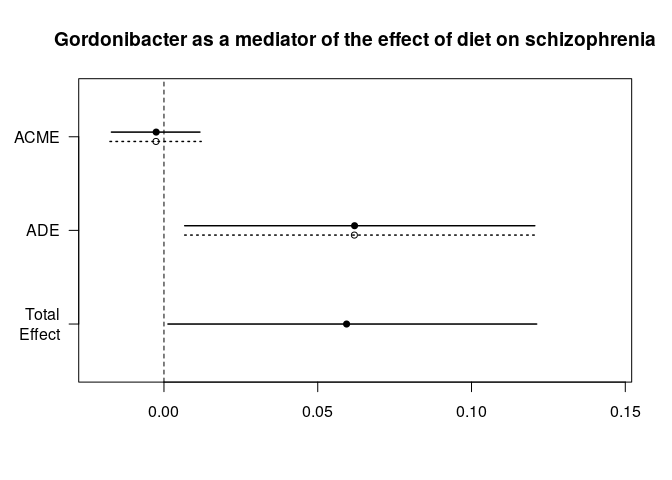
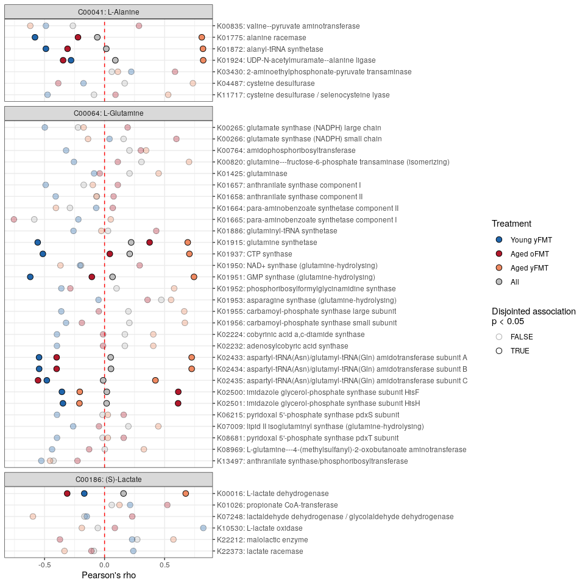
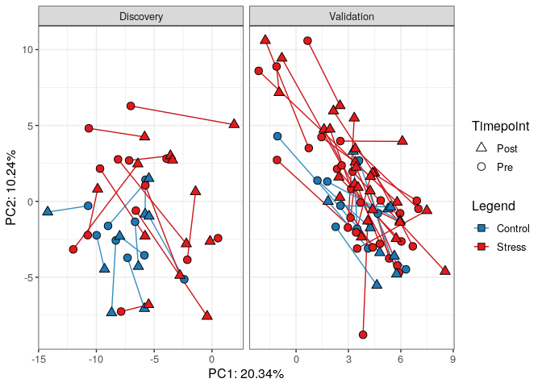
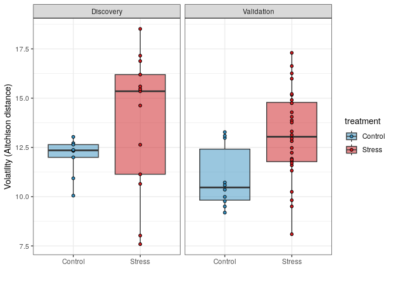

# 0. Introduction

Here, we will demonstrate four strategies to enrich microbiome-gut-brain
axis experiments. In this document we expand on the demonstration in the
supplementary files of the companion piece to this manuscript. We
strongly recommend readers go through that analysis before this
document, for the sake of continuity and clarity.

For this demonstration, we have adapted some shotgun metagenomic data
from the `curatedMetagenomicData` library in R. We’re looking at a human
cohort starring in the *Metagenome-wide association of gut microbiome
features for schizophrenia* study (DOI: 10.1038/s41467-020-15457-9).
After downloading the data it was simplified by summing together all
strains by genus. This will make it easier to analyse without access to
a server. For the set of operations used to pre-process, please see
section [Download and pre-process microbiome
data](https://github.com/thomazbastiaanssen/Tjazi/blob/master/guidebook_sup/part2/README_part2.md#gathering-and-preparing-our-data-1)
in this document. Briefly, in this data set, we have WGS data from
faecal samples from both patients with schizophrenia and healthy
volunteers, which will be referred to as “healthy” in the Legends. This
data has been included in the `Tjazi` library on github for easy access
purposes. All R code used to transform, wrangle (reorganise) and plot
the data is also shown below as to hopefully provide a toolkit for
aspiring and veteran bioinformaticians alike.

### Code chunk: Load our libraries

``` r
#Statistical tools        Primarily the CLR transformation.
library(Tjazi)            #devtools::install_github("thomazbastiaanssen/Tjazi")

#Data Wrangling
library(tidyverse)        #install.packages("tidyverse")
library(knitr)            #install.packages("knitr")

#Plotting
library(ggplot2)          #install.packages("ggplot2")
library(ggforce)          #install.packages("ggforce")
library(patchwork)        #install.packages("patchwork")

#Load prepared data from the schizophrenia study stored in the Tjazi library
data(guidebook_data)
```

# 1. Mediation analysis

Mediation analysis is a statistical tool that can help us answer causal
questions. Mediation analysis can be used to address core questions in
the microbiome-gut-brain axis field. One common and important example is
as follows:

- We know diet affects mental health.
- We also know diet affects the microbiome.
- We have observed associations between microbial taxa and mental
  health.

But how do we make sure that the association between the microbiome and
mental health isn’t due to the fact that they share a common ‘driver’,
namely diet, rendering our observed associations between the microbiome
and the brain merely spurious? Conversely, mediation analysis could help
us find to which degree the underlying mechanism of the effect of diet
on mental health is due to the effect of diet on the microbiome.

Here, we will demonstrate how one could go about performing mediation
analysis to ask and answer this question. We will use the 2020
schizophrenia data set to demonstrate this point. It should be noted
here that in reality, one would need strong biological mechanistic
reasons to perform a mediation analysis in order to make the ‘causal’
part in causal mediation analysis carry any meaning. Here we are just
performing the analysis for demonstrative purposes.

## Gathering and preparing our data

First, Let’s load the schizophrenia data set into our environment. We’ll
also quickly clean and CLR-transform our genus-level count table.

### Code chunk: Preparing microbiome data

``` r
#Set a seed for the purposes of reproducibility in this document.
set.seed(1)

#Load the mediation library and the relevant files for demo
library(mediation)
data(guidebook_data)
counts   <- counts ; metadata <- metadata ; diet <- diet

#Repeat the cleaning and transformation steps from part 1
metadata$master_ID <- gsub(metadata$master_ID, pattern = "-", replacement = ".")

counts  <- counts[,metadata$master_ID]

#Fork off your count data so that you always have an untouched version handy.
genus   <- counts

#make sure our count data is all numbers
genus   <- apply(genus,c(1,2),function(x) as.numeric(as.character(x)))

#Remove features with prevalence < 10% in two steps:
#First, determine how often every feature is absent in a sample
n_zeroes <- rowSums(genus == 0)

#Then, remove features that are absent in more than your threshold (90% in this case).
genus    <- genus[n_zeroes <= round(ncol(genus) * 0.90),]

#Perform a CLR transformation
genus.exp <- clr_c(genus)
```

## Preparing the dietary data

Furthermore, we will need to prepare the dietary data. For this study,
we have access to a table of five columns denoting how frequently our
participants eat food groups. It should be noted that we are only using
this data for demonstration purposes. In reality, the resolution of the
dietary information provided with this study would not be sufficient to
make any type of causal claim for several reasons. That said, let’s
convert the dietary frequency categories into numbers and then perform a
principal component analysis.

### Code chunk: Preparing dietary data

``` r
diet.pca = diet %>% 
  
#Replace text with numbers
  mutate(across(everything(), ~str_replace( ., "hardly",                      "1" )),
         across(everything(), ~str_replace( ., "often",                       "2" )),
         across(everything(), ~str_replace( ., "twice or three times a week", "3" )),
         across(everything(), ~str_replace( ., "every day",                   "4" )), 
         across(everything(), as.numeric)) %>% 

#Center and rescale data, then perform a principal component analysis
  scale() %>%   
  prcomp()       

#Let's check out the loadings of the first principal component using a histogram 
PC1 = diet.pca$x[,1]
hist(PC1)
```

<!-- -->

It’s always a good idea to visually inspect your data. From this
histogram, it looks like there may be two roughly normal populations in
our first principal component. We’ll take note of this and proceed with
our preparations.

## Prepare data for mediation analysis

We’ll take two of the bacteria, *Cronobacter* and *Gordonibacter*, that
were found to be statistically associated with schizophrenia in our
initial analysis. We’ll also take the first component of the dietary
intake PCA we generated above.

### Code chunk: Preparing for mediation analysis

``` r
df_mediation <- data.frame(
  Cronobacter    = unlist(genus.exp["Enterobacteriaceae_Cronobacter",]),
  Gordonibacter  = unlist(genus.exp["Eggerthellaceae_Gordonibacter",]),
  diet_PC1       = PC1, 
  phenotype      = metadata$Group == "schizophrenia")
```

## Fit models

For mediation analysis, we need to consider a few models. Microbes will
be playing the role of (potential) mediator here.

- First, we estimate the effect of diet on our phenotype:
  $phenotype \sim diet$. Does diet explain phenotype? If yes, we can
  proceed.

- Second, we estimate the effect of the microbe on our phenotype of
  interest: $phenotype \sim microbe$. Does the microbe also explain
  phenotype? If also yes, great, we have a potential mediation on our
  hands.

- Third, we estimate the effect of diet on our microbe of interest:
  $microbe \sim diet$. Does diet explain the abundance of our microbe?
  If yes, we can proceed. Now things are getting interesting as we have
  the scenario we laid out earlier.

- Fourth, we estimate the *joint* effect of diet and the microbe on our
  phenotype of interest: $phenotype \sim diet + microbe$. Does diet now
  explain phenotype worse in the presence of the microbe? If so, we have
  a potential mediation on our hands. In the case that diet no longer
  explains phenotype at all, we may be dealing with a full mediation. in
  the case of a reduction of explanatory potential, we rather speak of a
  potential partial mediation.

To check for a mediation effect, we use the `mediation` package.

In our case, the phenotype (schizophrenia diagnosis) is a binary
outcome. Because of that, we’ll use a logistic regression model rather
than a ‘regular’ linear model whenever we’re trying to explain
phenotype. We’ll use a link function for this.

Let’s give it a shot with our two bacteria.

### Code chunk: Fitting statistical models

``` r
#Cronobacter
#Does diet explain phenotype?
diet.fit1  <- glm(phenotype ~ diet_PC1, 
                  family = binomial("logit"), data = df_mediation)

#Does diet explain Cronobacter?
diba.fit1  <-  lm(Cronobacter ~ diet_PC1, data = df_mediation)

#Does Gordonibacter explain phenotype?
bact.fit1  <-  glm(phenotype ~ Cronobacter, 
                    family = binomial("logit"), data = df_mediation)

#Does diet explain phenotype on the presence of Cronobacter?
both.fit1  <- glm(phenotype ~ diet_PC1 + Cronobacter, 
                  family = binomial("logit"), data = df_mediation)

#Is there a mediation effect here?
crono = mediate(diba.fit1, both.fit1, 
                treat = 'diet_PC1', mediator = 'Cronobacter', boot = T)
```

    ## Running nonparametric bootstrap

``` r
#Gordonibacter
#Does diet explain phenotype?
diet.fit2  <- glm(phenotype ~ diet_PC1, 
                  family = binomial("logit"), data = df_mediation)

#Does diet explain Gordonibacter?
diba.fit2  <-  lm(Gordonibacter ~ diet_PC1, data = df_mediation)

#Does Gordonibacter explain phenotype?
bact.fit2  <-  glm(phenotype ~ Gordonibacter, 
                    family = binomial("logit"), data = df_mediation)

#Does diet explain phenotype on the presence of Gordonibacter?
both.fit2  <- glm(phenotype ~ diet_PC1 + Gordonibacter, 
                  family = binomial("logit"), data = df_mediation)

#Is there a mediation effect here?
gordo = mediate(diba.fit2, both.fit2, 
                treat = 'diet_PC1', mediator = 'Gordonibacter', boot = T)
```

    ## Running nonparametric bootstrap

Notice that in the `mediate` function calls, we’re essentially
estimating the explanatory potential of diet on our phenotype, in the
presence of our bacteria, in light of the fact that diet also explains
our bacterial abundance.

## Investigate results

Let’s take a look at the model summaries. We’ve picked the first
bacterium, *Cronobacter*, to display a statistically significant
mediation effect.

### Code chunk: Cronobacter results

``` r
#Collect the relevant data to display in tables
res_diet.fit1 <- coefficients(summary(diet.fit1))
res_diba.fit1 <- coefficients(summary(diba.fit1))
res_bact.fit1 <- coefficients(summary(bact.fit1))
res_both.fit1 <- coefficients(summary(both.fit1))
                      
#Plot the results in nice looking tables:
kable(res_diet.fit1, digits = 3, 
      caption = "Diet significantly explains phenotype (Estimate of 0.241).")
```

|             | Estimate | Std. Error | z value | Pr(\>\|z\|) |
|:------------|---------:|-----------:|--------:|------------:|
| (Intercept) |    0.106 |      0.155 |   0.687 |       0.492 |
| diet_PC1    |    0.241 |      0.122 |   1.972 |       0.049 |

Diet significantly explains phenotype (Estimate of 0.241).

``` r
kable(res_diba.fit1, digits = 3, 
      caption = "Diet significantly explains Cronobacter.")
```

|             | Estimate | Std. Error | t value | Pr(\>\|t\|) |
|:------------|---------:|-----------:|--------:|------------:|
| (Intercept) |   -2.461 |      0.114 | -21.676 |       0.000 |
| diet_PC1    |    0.182 |      0.088 |   2.061 |       0.041 |

Diet significantly explains Cronobacter.

``` r
kable(res_bact.fit1, digits = 3, 
      caption = "Cronobacter significantly explains phenotype. This comes as 
      no surprise as saw this in our initial differential abundance analysis.")
```

|             | Estimate | Std. Error | z value | Pr(\>\|z\|) |
|:------------|---------:|-----------:|--------:|------------:|
| (Intercept) |    0.882 |      0.332 |   2.655 |       0.008 |
| Cronobacter |    0.310 |      0.114 |   2.722 |       0.006 |

Cronobacter significantly explains phenotype. This comes as no surprise
as saw this in our initial differential abundance analysis.

``` r
kable(res_both.fit1, digits = 3, 
      caption = "In the presence of Cronobacter, diet significantly 
      explains phenotype less well (Estimate of 0.199).")
```

|             | Estimate | Std. Error | z value | Pr(\>\|z\|) |
|:------------|---------:|-----------:|--------:|------------:|
| (Intercept) |    0.831 |      0.337 |   2.467 |       0.014 |
| diet_PC1    |    0.199 |      0.124 |   1.601 |       0.109 |
| Cronobacter |    0.288 |      0.115 |   2.496 |       0.013 |

In the presence of Cronobacter, diet significantly explains phenotype
less well (Estimate of 0.199).

Looks like we may have a mediation effect here, so let’s check out the
results of our mediation analysis: ACME stands for Average Causal
Mediation Effect, whereas ADE stands for Average Direct Effect.

### Code chunk: Cronobacter mediation figure

``` r
summary(crono)
```

    ## 
    ## Causal Mediation Analysis 
    ## 
    ## Nonparametric Bootstrap Confidence Intervals with the Percentile Method
    ## 
    ##                           Estimate 95% CI Lower 95% CI Upper p-value  
    ## ACME (control)            0.012500     0.000837         0.03   0.030 *
    ## ACME (treated)            0.012209     0.000834         0.03   0.030 *
    ## ADE (control)             0.047085    -0.008466         0.10   0.094 .
    ## ADE (treated)             0.046795    -0.008487         0.10   0.094 .
    ## Total Effect              0.059294     0.006317         0.12   0.030 *
    ## Prop. Mediated (control)  0.210805    -0.011539         1.18   0.060 .
    ## Prop. Mediated (treated)  0.205907    -0.011134         1.19   0.060 .
    ## ACME (average)            0.012354     0.000836         0.03   0.030 *
    ## ADE (average)             0.046940    -0.008476         0.10   0.094 .
    ## Prop. Mediated (average)  0.208356    -0.011337         1.19   0.060 .
    ## ---
    ## Signif. codes:  0 '***' 0.001 '**' 0.01 '*' 0.05 '.' 0.1 ' ' 1
    ## 
    ## Sample Size Used: 171 
    ## 
    ## 
    ## Simulations: 1000

``` r
#Let's view the same information in a figure:
plot(crono, main = "Cronobacter as a mediator of the effect of diet on schizophrenia")
```

<!-- -->

Here, we see that our estimate of the Average Causal Mediation Effect
lies outside of zero. We have partial mediation. In other words, in this
example, it could be the case that part of the effect of diet on
schizophrenia happens because diet also influences *Cronobacter*, which
in turn influences schizophrenia.

Now, let’s take a look at a negative example with *Gordonibacter*.

### Code chunk: Gordonibacter results

``` r
#Collect the relevant data to display in tables
res_diet.fit2 <- coefficients(summary(diet.fit2))
res_diba.fit2 <- coefficients(summary(diba.fit2))
res_bact.fit2 <- coefficients(summary(bact.fit2))
res_both.fit2 <- coefficients(summary(both.fit2))
                      
#Plot the results in nice looking tables:
kable(res_diet.fit2, digits = 3, 
      caption = "Diet significantly explains phenotype (Estimate of 0.241).")
```

|             | Estimate | Std. Error | z value | Pr(\>\|z\|) |
|:------------|---------:|-----------:|--------:|------------:|
| (Intercept) |    0.106 |      0.155 |   0.687 |       0.492 |
| diet_PC1    |    0.241 |      0.122 |   1.972 |       0.049 |

Diet significantly explains phenotype (Estimate of 0.241).

``` r
kable(res_diba.fit2, digits = 3, 
      caption = "Diet does not significantly explain Gordonibacter")
```

|             | Estimate | Std. Error | t value | Pr(\>\|t\|) |
|:------------|---------:|-----------:|--------:|------------:|
| (Intercept) |   -1.734 |      0.114 | -15.175 |       0.000 |
| diet_PC1    |   -0.037 |      0.089 |  -0.410 |       0.682 |

Diet does not significantly explain Gordonibacter

``` r
kable(res_bact.fit2, digits = 3, 
      caption = "Gordonibacter significantly explains phenotype. This comes as 
      no surprise as saw this in our initial differential abundance analysis.")
```

|               | Estimate | Std. Error | z value | Pr(\>\|z\|) |
|:--------------|---------:|-----------:|--------:|------------:|
| (Intercept)   |    0.607 |      0.252 |   2.409 |       0.016 |
| Gordonibacter |    0.285 |      0.110 |   2.592 |       0.010 |

Gordonibacter significantly explains phenotype. This comes as no
surprise as saw this in our initial differential abundance analysis.

``` r
kable(res_both.fit2, digits = 3, 
      caption = "In the presence of Gordonibacter, diet explains phenotype even better
      (Estimate of 0.263).")
```

|               | Estimate | Std. Error | z value | Pr(\>\|z\|) |
|:--------------|---------:|-----------:|--------:|------------:|
| (Intercept)   |    0.633 |      0.255 |   2.484 |       0.013 |
| diet_PC1      |    0.263 |      0.125 |   2.099 |       0.036 |
| Gordonibacter |    0.299 |      0.111 |   2.686 |       0.007 |

In the presence of Gordonibacter, diet explains phenotype even better
(Estimate of 0.263).

Looks like we may have a mediation effect here, so let’s check out the
results of our mediation analysis: Again, ACME stands for Average Causal
Mediation Effect, whereas ADE stands for Average Direct Effect.

### Code chunk: Gordonibacter mediation figure

``` r
summary(gordo)
```

    ## 
    ## Causal Mediation Analysis 
    ## 
    ## Nonparametric Bootstrap Confidence Intervals with the Percentile Method
    ## 
    ##                          Estimate 95% CI Lower 95% CI Upper p-value  
    ## ACME (control)           -0.00260     -0.01755         0.01   0.720  
    ## ACME (treated)           -0.00253     -0.01708         0.01   0.720  
    ## ADE (control)             0.06191      0.00675         0.12   0.038 *
    ## ADE (treated)             0.06198      0.00675         0.12   0.038 *
    ## Total Effect              0.05938      0.00130         0.12   0.050 *
    ## Prop. Mediated (control) -0.04374     -0.67937         0.36   0.758  
    ## Prop. Mediated (treated) -0.04266     -0.66939         0.36   0.758  
    ## ACME (average)           -0.00257     -0.01749         0.01   0.720  
    ## ADE (average)             0.06194      0.00675         0.12   0.038 *
    ## Prop. Mediated (average) -0.04320     -0.67536         0.36   0.758  
    ## ---
    ## Signif. codes:  0 '***' 0.001 '**' 0.01 '*' 0.05 '.' 0.1 ' ' 1
    ## 
    ## Sample Size Used: 171 
    ## 
    ## 
    ## Simulations: 1000

``` r
#Let's view the same information in a figure:
plot(gordo, main = "Gordonibacter as a mediator of the effect of diet on schizophrenia")
```

<!-- -->

Here, we see that our estimate of the Average Causal Mediation Effect
lies squarely on zero. No mediation. This makes sense, as diet couldn’t
significantly explain the abundance of Gordonibacter.

------------------------------------------------------------------------

# 2. Multi-omics integration

Here, we will demonstrate how to integrate and subsequently analyse two
’omics data sets. For this, we will use the `anansi` framework and
package. Studies including both microbiome and metabolomics data are
becoming more common. Often, it would be helpful to integrate both data
sets in order to see if they corroborate each others patterns. All vs
all association is imprecise and likely to yield spurious associations.

The `anansi` package computes and compares the association between the
features of two ’omics data sets that are known to interact based on a
database such as KEGG. `anansi` takes a knowledge-based approach to
constrain association search space, only considering metabolite-function
interactions that have been recorded in a pathway database.

We’ll load a complementary training data set using `data(FMT_data)`.
This loads a curated snippet from the data set described in more detail
here: <https://doi.org/10.1038/s43587-021-00093-9>  
A very early version of `anansi` was used to generate “Extended Data
Fig. 7” in that paper.

### Code chunk: Load libraries and data

``` r
#install and load anansi
#devtools::install_github("thomazbastiaanssen/anansi")
library(anansi)

#load ggplot2 and ggforce to plot results
library(ggplot2)
library(ggforce)

#load dictionary and complementary human-readable names for KEGG compounds and orthologues
data(dictionary)
#load example data + metadata from FMT Aging study
data(FMT_data)
```

## Data preparation

The main `anansi` function expects data in the `anansiWeb` format;
Basically a list with exactly three tables: The first table, `tableY`,
should be a count table of metabolites. The second table, `tableX`,
should be a count table of functions. Both tables should have columns as
features and rows as samples.

The third table should be a binary adjacency matrix with the column
names of `tableY` as rows and the column names of `tableX` as columns.
Such an adjacency matrix is provided in the `anansi` library and is
referred to as a `dictionary` (because you use it to look up which
metabolites interact with which functions). We can load it using
`data(dictionary)`.

Though this example uses metabolites and functions, `anansi` is able to
handle any type of ’omics data, as long as there is a dictionary
available. Because of this, `anansi` uses the type-naive nomenclature
`tableY` and `tableX`. The Y and X refer to the position these
measurements will have in the linear modeling framework:

$$Y \sim X \times {\text{covariates}}$$

### A note on functional microbiome data

Two common questions in the host-microbiome field are “Who’s there?” and
“What are they doing?”.  
Techniques like 16S sequencing and shotgun metagenomics sequencing are
most commonly used to answer the first question. The second question can
be a bit more tricky - often we’ll need functional inference software to
address them. For 16S sequencing, algorithms like `PICRUSt2` and
`Piphillin` can be used to infer function. For shotgun metagenomics,
`HUMANn3` in the bioBakery suite or `woltka` can be used.  
All of these algorithms can produce functional count data in terms of
KEGG Orthologues (KOs). These tables can be directly plugged in to
`anansi`.

### Code chunk: Prepare data

``` r
#Clean and CLR-transform the KEGG orthologue table.

#Only keep functions that are represented in the dictionary.
KOs     <- FMT_KOs[row.names(FMT_KOs) %in% sort(unique(unlist(anansi_dic))),]

#Cut the decimal part off.
KOs     <- floor(KOs)

#Ensure all entires are numbers.
KOs     <- apply(KOs,c(1,2),function(x) as.numeric(as.character(x)))

#Remove all features with < 10% prevalence in the dataset.
KOs     <- KOs[apply(KOs == 0, 1, sum) <= (ncol(KOs) * 0.90), ] 

#Perform a centered log-ratio transformation on the functional count table.
KOs.exp <- clr_c(KOs)

#anansi expects samples to be rows and features to be columns. 
t1      <- t(FMT_metab)
t2      <- t(KOs.exp)
```

## Weave a web

The `weaveWebFromTables()` function can be used to parse the tables that
we prepared above into an `anansiWeb` object. The `anansiWeb` format is
a necessary input file for the main `anansi` workflow.

### Code chunk: Generate web object

``` r
web <- weaveWebFromTables(tableY = t1, tableX = t2, dictionary = anansi_dic)
```

    ## [1] "Operating in interaction mode"
    ## [1] "3 were matched between table 1 and the columns of the adjacency matrix"
    ## [1] "50 were matched between table 2 and the rows of the adjacency matrix"

## Run anansi

The main workspider in this package is called `anansi`. Generally, you
want to give it three arguments. First, there’s `web`, which is an
`anansiWeb` object, such as the one we generated in the above step.
Second, there’s `formula`, which should be a formula. For instance, to
assess differential associations between treatments, we use the formula
`~Treatment`, provided we have a column with that name in our `metadata`
object, the Third argument.

### Code chunk: Run anansi

``` r
anansi_out <- anansi(web      = web,          #Generated above
                     method   = "pearson",    #Define the type of correlation used
                     formula  = ~ Legend,     #Compare associations between treatments
                     metadata = FMT_metadata, #With data referred to in formula as column
                     adjust.method = "BH",    #Apply the Benjamini-Hochberg procedure
                     verbose  = T             #To let you know what's happening
                     )
```

    ## [1] "Running annotation-based correlations"
    ## [1] "Running correlations for the following groups: All, Aged yFMT, Aged oFMT, Young yFMT"
    ## [1] "Fitting models for differential correlation testing"
    ## [1] "Model type:lm"
    ## [1] "Adjusting p-values using Benjamini & Hochberg's procedure."
    ## [1] "Using theoretical distribution."

## Spin to a table

`anansi` gives a complex nested `anansiYarn` object as an output. Two
functions exist that will wrangle your data to more friendly formats for
you. You can either use `spinToLong()` or `spinToWide()`. They will give
you long or wide format data.frames, respectively. For general
reporting, we recommend sticking to the wide format as it’s the most
legible. You can also use the `plot()` method on an `anansiYarn` object
to gain some insights in the state of your p, q, R and R<sup>2</sup>
parameters.

### Code chunk: Parse anansi results

``` r
anansiLong <- spinToLong(anansi_output = anansi_out, translate = T, 
                         Y_translation = anansi::cpd_translation, 
                         X_translation = anansi::KO_translation)  
#Now it's ready to be plugged into ggplot2, though let's clean up a bit more. 

#Only consider interactions where the entire model fits well enough. 
anansiLong <- anansiLong[anansiLong$model_full_q.values < 0.1,]
```

## Plot the results

The long format can be helpful to plug the data into `ggplot2`. Here, we
recreate part of the results from the FMT Aging study.

### Code chunk: Plot anansi results

``` r
ggplot(data = anansiLong, 
       aes(x      = r.values, 
           y      = feature_X, 
           fill   = type, 
           alpha  = model_disjointed_Legend_p.values < 0.05)) + 
  
  #Make a vertical dashed red line at x = 0
  geom_vline(xintercept = 0, linetype = "dashed", colour = "red")+
  
  #Points show  raw correlation coefficients
  geom_point(shape = 21, size = 3) + 
  
  #facet per compound
  ggforce::facet_col(~feature_Y, space = "free", scales = "free_y") + 
  
  #fix the scales, labels, theme and other layout
  scale_y_discrete(limits = rev, position = "right") +
  scale_alpha_manual(values = c("TRUE" = 1, 
                                "FALSE" = 1/3), "Disjointed association\np < 0.05") +
  scale_fill_manual(values = c("Young yFMT" = "#2166ac", 
                               "Aged oFMT"  = "#b2182b", 
                               "Aged yFMT"  = "#ef8a62", 
                               "All"        = "gray"), 
                    breaks = c("Young yFMT", "Aged oFMT", "Aged yFMT", "All"), 
                    "Treatment")+
  theme_bw() + 
  ylab("") + 
  xlab("Pearson's rho")
```

<!-- -->

Here, we can see the per-group correlations between metabolite-function
pairs in terms of Pearson’s correlation coefficient on the x-axis.
Opaque points indicate significantly disjointed associations, meaning
that these associations have a significantly different slope between
groups.

------------------------------------------------------------------------

# 3. Computing functional modules

Functional modules such as the Gut Brain modules shown here can be a
valuable framework to investigate your data through. One major benefit
of this framework is that you greatly reduce your search-space to
specific functional pathways you’re interested in. This will allow you
to greatly save on statistical tests, which in turn will help save
statistical power when accounting for FDR.

Here, we will demonstrate how we got to the Gut Brain modules from our
the schizophrenia data set. Be warned that the first few operations here
are computationally very expensive and should be performed on a server
or similar if possible.

## Gathering and preparing our data

First, let’s download the necessary data from `curatedMicrobiomeData`

### Code chunk: Download and pre-process microbiome data

``` r
#Load the relevant libraries
library(curatedMetagenomicData)
library(SummarizedExperiment)

#Define what data we're interested in. The "|" sign here signifies that we want both.
query <- "2021-03-31.ZhuF_2020.relative_abundance|2021-03-31.ZhuF_2020.gene_families"

#Download the specified data. This will take time. 
ZhuF <- curatedMetagenomicData(query, counts = T, dryrun = F)

#Extract the relevant data from complex SummarizedExperiment objects
Zhu_F_gene_families = as.matrix( SummarizedExperiment::assay(ZhuF[[1]]))     #Functions
Zhu_F_microbiome    = data.frame(SummarizedExperiment::assay(ZhuF[[2]]))    #Taxa
Zhu_F_metadata      = data.frame(SummarizedExperiment::colData(ZhuF[[2]]))  #Metadata

genus_lv_counts <- Zhu_F_microbiome %>% 
  rownames_to_column("X") %>%
  
  #Collapse to genus level
  mutate(X = str_remove(X, "\\|s__.*")) %>% 
  group_by(X) %>% 
  summarise(across(everything(), sum)) %>% 
  ungroup() %>% 
  
  #Clean up the names
  mutate(X = str_remove(X, ".*\\|f__")) %>% 
  mutate(X = str_replace(X, "\\|g__", "_")) %>% 
  mutate(X = str_replace(X, "Clostridiales_unclassified_", "Clostridiales_")) %>% 
  filter(X != "Clostridiales_Clostridiales_unclassified") %>% 
  
  #Restore row.names
  column_to_rownames("X")

#Should be identical to file used
waldo::compare(sort(row.names(genus_lv_counts)), sort(row.names(counts)))

#Now that we have our data, we can write the individual tables to csv files. 
#We'll focus on the gene families here, they're necessary to compute Gut Brain modules.

write.csv(Zhu_F_gene_families, file = "uniref90.csv")
write.csv(Zhu_F_microbiome,    file = "counts.csv")
```

## Convert to KEGG orthologues

`Zhu_F_gene_families` contains the functional microbiome in terms of
uniref90. For functional module analysis, we typically want to get to
KEGG orthologues (KOs). Because `curatedMetagenomicData` gives
essentially biobakery output, we can use commands from the python-based
`HUMAnN3` pipeline to translate our uniref90 table to KEGG orthologues.
We will not go deeply into this, but see the excellent documentation
here: <https://github.com/biobakery/humann#humann_regroup_table>

**The next snippet is not R code, but rather Bash code.**

### Code chunk: Convert functional table to KEGG orthologues

``` bash

#First, we may want to change our uniref90 file so that it uses tabs instead of commas
sed -E 's/("([^"]*)")?,/\2\t/g' uniref90.csv  > uniref90.tsv

#Then, let's use humann_regroup_table from HUMAnN3 to convert to KEGG orthologues:
humann_regroup_table -i uniref90.tsv -g uniref90_ko -o guidebook_out_KOs.tsv
```

## Compute functional modules

Now that we have our functional microbiome in terms of KEGG orthologues,
we can load them back into R. An added benefit is that the KEGG
orthologues table is much smaller than the uniref90 table, so we can
deal with it on our computer locally if we so choose. In order to do
this, we will require the `omixer-rpmR` library which can be found of
github. If you’re working with functional inference data from a 16S
experiment, such as output from `PICRUSt2`, you should be able to read
the table in and compute functional modules starting at this step. The
file you’re looking for would be called something like
`pred_metagenome_unstrat.tsv` in that case.

### Code chunk: Generate functional modules

``` r
#Load the required package
library(omixerRpm) #devtools::install_github("omixer/omixer-rpmR")

#Load the KEGG orthologue table into R. 
#Note that KEGG orthologue names should be the in first column, not the row names.  
KOs <- read.delim("guidebook_out_KOs.tsv", header = T)

#listDB will tell you which databases are available to annotate the functional data with. 
listDB()

#Pick the most recent GBM database
db <- loadDB(name = "GBMs.v1.0")

#Calculate GBM abundance and convert the output to a nice data.frame
GBMs <- rpm(x = KOs,  module.db = db)
GBMs <- asDataFrame(GBMs, "abundance")

#Write the file to a csv to save it. 
write.csv(GBMs, file = "GBMs_guidebook.csv")

#While we're at it, let's do GMMs too: First check the names of the available databases:
listDB()

#Pick the most recent GMM database
db <- loadDB(name = "GMMs.v1.07")

#Calculate GMM abundance and convert the output to a nice data.frame
GMMs <- rpm(x = KOs,  module.db = db)
GMMs <- asDataFrame(GMMs, "abundance")

#Write the file to a csv to save it. 
write.csv(GMMs, file = "GMMs_guidebook.csv")
```

And the resulting files are ready for statistical analysis! I would like
to note here that it’s also possible to perform a stratified functional
module analysis, where the contribution of each taxon to each functional
module is also considered. However, this explosively increases the
dimensionality of your data (i.e. you get way more rows in our case). I
would only recommend doing this as a targeted analysis as the power of
any statistical tests will suffer greatly and the results will be almost
impossible to interpret.

------------------------------------------------------------------------

# 4. Volatility Analysis

Volatility refers to the degree of instability (or change over time) in
the microbiome. High volatility, i.e. an unstable microbiome, has been
associated with an exaggerated stress response and conditions like IBS.
Here, we’ll demonstrate how one would go about calculating volatility in
a real data set. Volatility analysis requires at least two time points
per sample. Because of this, we cannot use the schizophrenia data set
which only features single snapshots of the microbiome.

We’ll be taking a look at the datasets used in the original Volatility
paper: *Volatility as a Concept to Understand the Impact of Stress on
the Microbiome* (DOI: 10.1016/j.psyneuen.2020.105047). Very briefly,
mice were separated into two groups: Control and Stress. Faecal samples
were taken twice, with a 10-day period in between. In this 10-day
period, the mice in the Stress group were subjected to daily social
defeat stress, whereas the Control mice were left alone. When we
compared the degree of change in the microbiome (i.e. Volatility)
between the two groups of mice, the Stressed mice consistently displayed
higher levels of volatility than the control mice. Our reviewers asked
us to replicate the experiment and we did so. The two cohorts are
labeled discovery and validation. This data has been included in the
`volatility` library on github for easy access purposes.

Traditionally, microbiome studies featuring high-throughput sequencing
data only consider a single time point. However, there is utility in
considering microbiomes as dynamic microbial ecosystems that change over
time. By measuring the microbiome longitudinally and computing
volatility, additional information can be revealed that would otherwise
be missed. For instance, in the original volatility study, we found that
volatility after stress is positively associated with severity of the
stress response, including in terms of behaviour and
hypothalamic-pituitary-adrenal (HPA) axis activity, both in mice and in
humans.

## Setup

OK, now let’s get started.

### Code chunk: Load data

``` r
#Install and load volatility library
library(volatility)     #devtools::install_github("thomazbastiaanssen/volatility")

#Load tidyverse to wrangle and plot results.
library(tidyverse)

#Load example data + metadata from the volatility study.
data(volatility_data)
```

## Considering our input data

The main `volatility` function does all the heavy lifting here. It
expects two arguments: The first argument is `counts`, a microbiome
feature count table, with columns as samples and rows and features. The
`vola_genus_table` object is an example of an appropriately formatted
count table.

### Code chunk: Examine required data format

``` r
vola_genus_table[4:9,1:2]
```

    ##                               Validation_Pre_Control_1 Validation_Pre_Control_2
    ## Atopobiaceae_Olsenella                               0                        0
    ## Coriobacteriaceae_Collinsella                        0                        0
    ## Eggerthellaceae_DNF00809                           102                       47
    ## Eggerthellaceae_Enterorhabdus                       53                      114
    ## Eggerthellaceae_Parvibacter                         21                       20
    ## Bacteroidaceae_Bacteroides                         616                      453

The second arguent is `metadata`, a vector in the same order as the
count table, denoting which samples are from the same source. The column
`ID` in `vola_metadata` is appropriate for this.

### Code chunk: Examine required metadata format

``` r
head(vola_metadata, 5)
```

    ##                  sample_ID     cohort timepoint treatment ID
    ## 1 Validation_Pre_Control_1 Validation       Pre   Control  1
    ## 2 Validation_Pre_Control_2 Validation       Pre   Control  2
    ## 3 Validation_Pre_Control_3 Validation       Pre   Control  3
    ## 4 Validation_Pre_Control_4 Validation       Pre   Control  4
    ## 5 Validation_Pre_Control_5 Validation       Pre   Control  5

### Code chunk: Prepare the data for plotting

``` r
#This part should feel very reminiscent of what we did in chapters 1 & 3. 
counts  <- vola_genus_table[,vola_metadata$sample_ID]

#Fork off your count data so that you always have an untouched version handy.
genus   <- counts

#make sure our count data is all numbers
genus   <- apply(genus,c(1,2),function(x) as.numeric(as.character(x)))

#Remove features with prevalence < 10% in two steps:
#First, determine how often every feature is absent in a sample
n_zeroes <- rowSums(genus == 0)

#Then, remove features that are absent in more than your threshold (90% in this case).
genus    <- genus[n_zeroes <= round(ncol(genus) * 0.90),]

#Perform a CLR transformation
genus.exp <- clr_c(genus)

#Apply the base R principal component analysis function on our CLR-transformed data.
data.a.pca  <- prcomp(t(genus.exp))
```

## Plot data

### Code chunk: Plot longitudinal PCA

``` r
#Extract the amount of variance the first four components explain for plotting. 
pc1 <- round(data.a.pca$sdev[1]^2/sum(data.a.pca$sdev^2),4) * 100
pc2 <- round(data.a.pca$sdev[2]^2/sum(data.a.pca$sdev^2),4) * 100
pc3 <- round(data.a.pca$sdev[3]^2/sum(data.a.pca$sdev^2),4) * 100
pc4 <- round(data.a.pca$sdev[4]^2/sum(data.a.pca$sdev^2),4) * 100

#Extract the scores for every sample for the first four components for plotting. 
pca  = data.frame(PC1 = data.a.pca$x[,1], 
                  PC2 = data.a.pca$x[,2], 
                  PC3 = data.a.pca$x[,3], 
                  PC4 = data.a.pca$x[,4])

#Add relevant information from the metadata. 
#Note that ID here refers to the mouse ID, not the sample ID. 
pca$ID                  = vola_metadata$ID
pca$Legend              = vola_metadata$treatment
pca$Timepoint           = vola_metadata$timepoint
pca$Cohort              = vola_metadata$cohort

#Plot the first two components of the PCA.
ggplot(pca, aes(x       = PC1, 
                y       = PC2, 
                fill    = Legend,
                colour  = Legend,
                shape   = Timepoint, 
                group   = ID)) +  
  #Add a line first, it will link points that share an ID. 
  geom_line() +
  
  #Then add the points.
  geom_point(size = 3, col = "black") + 
  
  #Plot the two cohorts separately. 
  facet_wrap(~Cohort, scales = "free_x", strip.position = "top") +
  
  #Improve appearance.
  scale_fill_manual(  values = c("Control"  = "#1f78b4", 
                                 "Stress"   = "#e31a1c")) + 
  scale_colour_manual(values = c("Control"  = "#3690c0", 
                                 "Stress"   = "#cb181d")) + 
  scale_shape_manual( values = c("Pre"  = 21, 
                                "Post" = 24)) +  
  theme_bw() +
  xlab(paste("PC1: ", pc1,  "%", sep="")) + 
  ylab(paste("PC2: ", pc2,  "%", sep="")) + 
  theme(text = element_text(size = 12)) +
  guides(fill = guide_legend(override.aes = list(shape = 22)))
```

<!-- -->

We can see that points from the same mouse are connected by a line. It
looks like some lines are longer than others, implying that some
microbiomes have changed more than others over the 10 days. However,
We’re only looking at about 30% of the variance here, so it’s hard to
say anything conclusive.

## Compute volatility

Volatility between two samples can be easily calculated using the
titular `volatilty` function in the library by the same name. Under the
hood, volatility can be calculated as the euclidean distance over
CLR-transformed count data.

### Code chunk: Calculate volatility

``` r
vola_out <- volatility(counts = genus, metadata = vola_metadata$ID)

head(vola_out)
```

    ##   ID volatility
    ## 1  1  13.275363
    ## 2 10  12.979717
    ## 3 11  15.987468
    ## 4 13  14.902772
    ## 5 14   8.094823
    ## 6 15   9.506299

The output of the main `volatility` function is a data.frame with two
columns. `ID` corresponds to the pairs of samples passed on in the
`metadata` argument, whereas `volatility` shows the measured volatility
between those samples in terms of Aitchison distance (Euclidean distance
of CLR-transformed counts).

## Plot the results

### Code chunk: Plot volatility

``` r
vola_out %>%
  #Merge the volatilty output with the rest of the metadata using the shared "ID" column.
  left_join(vola_metadata[vola_metadata$timepoint == "Pre",], "ID") %>%
  
  #Pipe into ggplot.
  ggplot(aes(x = treatment, y = volatility, fill = treatment)) +
  
  #Define geoms, boxplots overlayed with data points in this case.
  geom_boxplot(alpha = 1/2, coef = 10)+
  geom_point(shape = 21) +
  
  #Split the plot by cohort.
  facet_wrap(~cohort) +
  
  #Tweak appearance.
  scale_fill_manual(values = c("Control" = "#3690c0", "Stress"  = "#cb181d")) +
  theme_bw() +
  xlab("") +
  ylab("Volatility (Aitchison distance)")
```

<!-- -->

------------------------------------------------------------------------

# 5. Discussion

Here, we have presented four separate primers for techniques from four
distinct topics, namely causal inference, multi-omics integration,
mesoscale analysis and temporal analysis, and how one may go about
applying them to microbiome-gut-brain axis experiments. While these
techniques and corresponding fields may seem unrelated, we are of the
opinion that all four will be essential to move the microbiome-gut-brain
axis field forward towards an ecology oriented, mechanistic
understanding.

As said in the discussion of part 1 of this perspective, this document
is just a template. Depending on the experimental setup, findings and
experimental questions, you may want to choose a differing approach.
Given the highly complex nature of microbiome data, one should ideally
avoid blindly applying models and pipelines without understanding what
they are doing. D.R. Cox is famously ascribed the statement: *“Most real
life statistical problems have one or more nonstandard features. There
are no routine statistical questions; only questionable statistical
routines.”* We find this holds true for the microbiome as well, even
more so for these more advanced techniques than for the ones presented
in part 1 of this perspective piece. In particular, it is crucial that
we apply our biological knowledge to determine how exactly to use these
techniques. For instance, when performing a mediation analysis in
section 1, it is crucial to have a biological reason why one would
expect the effect of a variable on an outcome to be moderated by a
second variable. Similarly, with the multi-omics integration using
anansi in section 2, we’re relying on pre-existing biological knowledge
in the form of the KEGG database to only investigate interactions
between metabolites and enzymatic functions that could take place,
rather than naively assessing all of them.

Clear communication, both in terms of describing and explaining our
methods as well as in terms of figure presentation, are essential for
the health of the field. Indeed, failing to do so can lead to confusion
among our peers. We hope that both aspiring and veteran
bioinformaticians will find our guide helpful. We have tried to model
this piece after what we would have loved to have access to ourselves
when we first set out to study the microbiome.

------------------------------------------------------------------------

# Session Info

``` r
sessioninfo::session_info()
```

    ## ─ Session info ───────────────────────────────────────────────────────────────
    ##  setting  value
    ##  version  R version 4.2.2 Patched (2022-11-10 r83330)
    ##  os       Ubuntu 18.04.6 LTS
    ##  system   x86_64, linux-gnu
    ##  ui       X11
    ##  language en_IE:en
    ##  collate  en_IE.UTF-8
    ##  ctype    en_IE.UTF-8
    ##  tz       Europe/Dublin
    ##  date     2023-07-19
    ##  pandoc   2.19.2 @ /usr/lib/rstudio/resources/app/bin/quarto/bin/tools/ (via rmarkdown)
    ## 
    ## ─ Packages ───────────────────────────────────────────────────────────────────
    ##  package       * version    date (UTC) lib source
    ##  anansi        * 0.5.0      2023-04-25 [1] Github (thomazbastiaanssen/anansi@e188997)
    ##  assertthat      0.2.1      2019-03-21 [1] CRAN (R 4.2.0)
    ##  backports       1.4.1      2021-12-13 [1] CRAN (R 4.2.0)
    ##  base64enc       0.1-3      2015-07-28 [1] CRAN (R 4.2.0)
    ##  boot            1.3-28     2021-05-03 [4] CRAN (R 4.0.5)
    ##  broom           1.0.2      2022-12-15 [1] CRAN (R 4.2.1)
    ##  cellranger      1.1.0      2016-07-27 [1] CRAN (R 4.2.0)
    ##  checkmate       2.1.0      2022-04-21 [1] CRAN (R 4.2.0)
    ##  cli             3.6.0      2023-01-09 [1] CRAN (R 4.2.1)
    ##  cluster         2.1.4      2022-08-22 [4] CRAN (R 4.2.1)
    ##  codetools       0.2-19     2023-02-01 [4] CRAN (R 4.2.2)
    ##  colorspace      2.0-3      2022-02-21 [1] CRAN (R 4.2.0)
    ##  crayon          1.5.2      2022-09-29 [1] CRAN (R 4.2.1)
    ##  data.table      1.14.6     2022-11-16 [1] CRAN (R 4.2.1)
    ##  DBI             1.1.3      2022-06-18 [1] CRAN (R 4.2.0)
    ##  dbplyr          2.3.0      2023-01-16 [1] CRAN (R 4.2.1)
    ##  deldir          1.0-6      2021-10-23 [1] CRAN (R 4.2.1)
    ##  digest          0.6.31     2022-12-11 [1] CRAN (R 4.2.1)
    ##  dplyr         * 1.0.10     2022-09-01 [1] CRAN (R 4.2.1)
    ##  ellipsis        0.3.2      2021-04-29 [1] CRAN (R 4.2.0)
    ##  evaluate        0.20       2023-01-17 [1] CRAN (R 4.2.1)
    ##  fansi           1.0.3      2022-03-24 [1] CRAN (R 4.2.0)
    ##  farver          2.1.1      2022-07-06 [1] CRAN (R 4.2.1)
    ##  fastmap         1.1.0      2021-01-25 [1] CRAN (R 4.2.0)
    ##  forcats       * 0.5.2      2022-08-19 [1] CRAN (R 4.2.1)
    ##  foreign         0.8-82     2022-01-13 [4] CRAN (R 4.1.2)
    ##  Formula         1.2-4      2020-10-16 [1] CRAN (R 4.2.0)
    ##  fs              1.5.2      2021-12-08 [1] CRAN (R 4.2.0)
    ##  future          1.30.0     2022-12-16 [1] CRAN (R 4.2.1)
    ##  future.apply    1.10.0     2022-11-05 [1] CRAN (R 4.2.1)
    ##  gargle          1.2.1      2022-09-08 [1] CRAN (R 4.2.1)
    ##  generics        0.1.3      2022-07-05 [1] CRAN (R 4.2.1)
    ##  ggforce       * 0.4.1      2022-10-04 [1] CRAN (R 4.2.1)
    ##  ggplot2       * 3.4.0      2022-11-04 [1] CRAN (R 4.2.1)
    ##  globals         0.16.2     2022-11-21 [1] CRAN (R 4.2.1)
    ##  glue            1.6.2      2022-02-24 [1] CRAN (R 4.2.0)
    ##  googledrive     2.0.0      2021-07-08 [1] CRAN (R 4.2.0)
    ##  googlesheets4   1.0.1      2022-08-13 [1] CRAN (R 4.2.1)
    ##  gridExtra       2.3        2017-09-09 [1] CRAN (R 4.2.0)
    ##  gtable          0.3.1      2022-09-01 [1] CRAN (R 4.2.1)
    ##  haven           2.5.1      2022-08-22 [1] CRAN (R 4.2.1)
    ##  highr           0.10       2022-12-22 [1] CRAN (R 4.2.1)
    ##  Hmisc           4.7-2      2022-11-18 [1] CRAN (R 4.2.1)
    ##  hms             1.1.2      2022-08-19 [1] CRAN (R 4.2.1)
    ##  htmlTable       2.4.1      2022-07-07 [1] CRAN (R 4.2.1)
    ##  htmltools       0.5.4      2022-12-07 [1] CRAN (R 4.2.1)
    ##  htmlwidgets     1.6.1      2023-01-07 [1] CRAN (R 4.2.1)
    ##  httr            1.4.4      2022-08-17 [1] CRAN (R 4.2.1)
    ##  interp          1.1-3      2022-07-13 [1] CRAN (R 4.2.1)
    ##  jpeg            0.1-10     2022-11-29 [1] CRAN (R 4.2.1)
    ##  jsonlite        1.8.4      2022-12-06 [1] CRAN (R 4.2.1)
    ##  knitr         * 1.41       2022-11-18 [1] CRAN (R 4.2.1)
    ##  labeling        0.4.2      2020-10-20 [1] CRAN (R 4.2.0)
    ##  lattice         0.20-45    2021-09-22 [4] CRAN (R 4.2.0)
    ##  latticeExtra    0.6-30     2022-07-04 [1] CRAN (R 4.2.1)
    ##  lifecycle       1.0.3      2022-10-07 [1] CRAN (R 4.2.1)
    ##  listenv         0.9.0      2022-12-16 [1] CRAN (R 4.2.1)
    ##  lme4            1.1-29     2022-04-07 [1] CRAN (R 4.2.0)
    ##  lpSolve         5.6.18     2023-02-01 [1] CRAN (R 4.2.2)
    ##  lubridate       1.9.0      2022-11-06 [1] CRAN (R 4.2.1)
    ##  magrittr        2.0.3      2022-03-30 [1] CRAN (R 4.2.0)
    ##  MASS          * 7.3-58.2   2023-01-23 [4] CRAN (R 4.2.2)
    ##  Matrix        * 1.5-3      2022-11-11 [1] CRAN (R 4.2.1)
    ##  mediation     * 4.5.0      2019-10-08 [1] CRAN (R 4.2.2)
    ##  minqa           1.2.5      2022-10-19 [1] CRAN (R 4.2.1)
    ##  modelr          0.1.10     2022-11-11 [1] CRAN (R 4.2.1)
    ##  munsell         0.5.0      2018-06-12 [1] CRAN (R 4.2.0)
    ##  mvtnorm       * 1.1-3      2021-10-08 [1] CRAN (R 4.2.1)
    ##  nlme            3.1-162    2023-01-31 [4] CRAN (R 4.2.2)
    ##  nloptr          2.0.3      2022-05-26 [1] CRAN (R 4.2.0)
    ##  nnet            7.3-18     2022-09-28 [4] CRAN (R 4.2.1)
    ##  parallelly      1.34.0     2023-01-13 [1] CRAN (R 4.2.1)
    ##  patchwork     * 1.1.2      2022-08-19 [1] CRAN (R 4.2.1)
    ##  pillar          1.8.1      2022-08-19 [1] CRAN (R 4.2.1)
    ##  pkgconfig       2.0.3      2019-09-22 [1] CRAN (R 4.2.0)
    ##  png             0.1-8      2022-11-29 [1] CRAN (R 4.2.1)
    ##  polyclip        1.10-4     2022-10-20 [1] CRAN (R 4.2.1)
    ##  propr           4.2.6      2019-12-16 [1] CRAN (R 4.2.1)
    ##  purrr         * 1.0.1      2023-01-10 [1] CRAN (R 4.2.1)
    ##  R6              2.5.1      2021-08-19 [1] CRAN (R 4.2.0)
    ##  RColorBrewer    1.1-3      2022-04-03 [1] CRAN (R 4.2.0)
    ##  Rcpp            1.0.9      2022-07-08 [1] CRAN (R 4.2.1)
    ##  readr         * 2.1.3      2022-10-01 [1] CRAN (R 4.2.1)
    ##  readxl          1.4.1      2022-08-17 [1] CRAN (R 4.2.1)
    ##  reprex          2.0.2      2022-08-17 [1] CRAN (R 4.2.1)
    ##  rlang           1.0.6      2022-09-24 [1] CRAN (R 4.2.1)
    ##  rmarkdown       2.20       2023-01-19 [1] CRAN (R 4.2.1)
    ##  rpart           4.1.19     2022-10-21 [4] CRAN (R 4.2.1)
    ##  rstudioapi      0.14       2022-08-22 [1] CRAN (R 4.2.1)
    ##  rvest           1.0.3      2022-08-19 [1] CRAN (R 4.2.1)
    ##  sandwich      * 3.0-2      2022-06-15 [1] CRAN (R 4.2.2)
    ##  scales          1.2.1      2022-08-20 [1] CRAN (R 4.2.1)
    ##  sessioninfo     1.2.2      2021-12-06 [1] CRAN (R 4.2.0)
    ##  stringi         1.7.12     2023-01-11 [1] CRAN (R 4.2.1)
    ##  stringr       * 1.5.0      2022-12-02 [1] CRAN (R 4.2.1)
    ##  survival        3.4-0      2022-08-09 [4] CRAN (R 4.2.1)
    ##  tibble        * 3.1.8      2022-07-22 [1] CRAN (R 4.2.1)
    ##  tidyr         * 1.2.1      2022-09-08 [1] CRAN (R 4.2.1)
    ##  tidyselect      1.2.0      2022-10-10 [1] CRAN (R 4.2.1)
    ##  tidyverse     * 1.3.2      2022-07-18 [1] CRAN (R 4.2.1)
    ##  timechange      0.2.0      2023-01-11 [1] CRAN (R 4.2.1)
    ##  Tjazi         * 0.1.0.0    2023-04-26 [1] Github (thomazbastiaanssen/Tjazi@91f5c82)
    ##  tweenr          2.0.2      2022-09-06 [1] CRAN (R 4.2.1)
    ##  tzdb            0.3.0      2022-03-28 [1] CRAN (R 4.2.0)
    ##  utf8            1.2.2      2021-07-24 [1] CRAN (R 4.2.0)
    ##  vctrs           0.5.1      2022-11-16 [1] CRAN (R 4.2.1)
    ##  volatility    * 0.0.0.9000 2022-05-25 [1] Github (thomazbastiaanssen/Volatility@c1f50bf)
    ##  withr           2.5.0      2022-03-03 [1] CRAN (R 4.2.0)
    ##  xfun            0.36       2022-12-21 [1] CRAN (R 4.2.1)
    ##  xml2            1.3.3      2021-11-30 [1] CRAN (R 4.2.0)
    ##  yaml            2.3.6      2022-10-18 [1] CRAN (R 4.2.1)
    ##  zoo             1.8-12     2023-04-13 [1] CRAN (R 4.2.2)
    ## 
    ##  [1] /home/thomaz/R/x86_64-pc-linux-gnu-library/4.2
    ##  [2] /usr/local/lib/R/site-library
    ##  [3] /usr/lib/R/site-library
    ##  [4] /usr/lib/R/library
    ## 
    ## ──────────────────────────────────────────────────────────────────────────────
